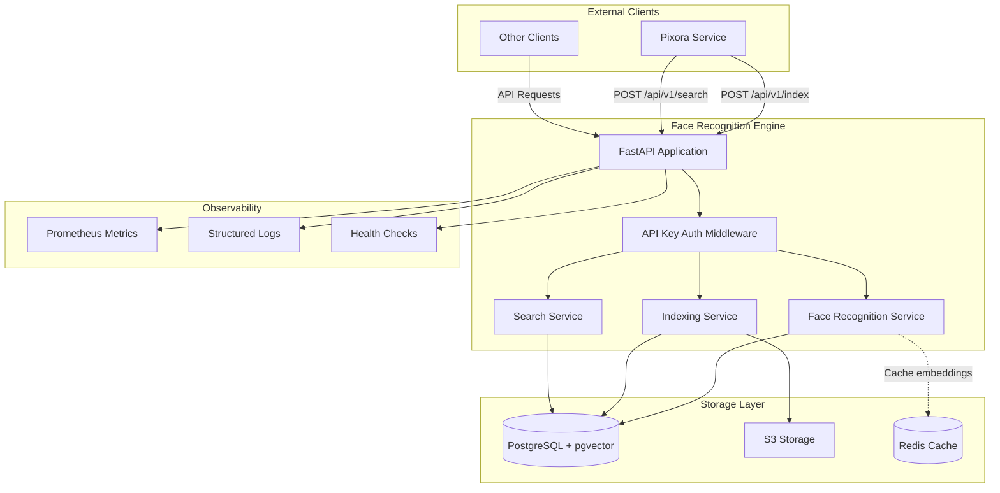
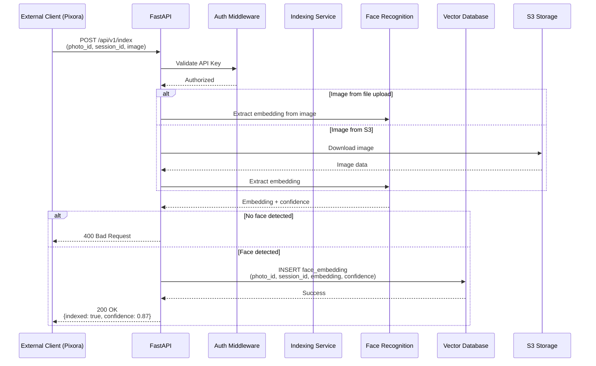
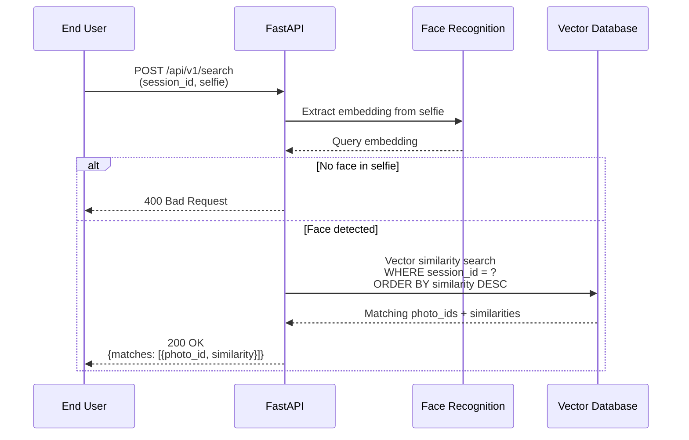
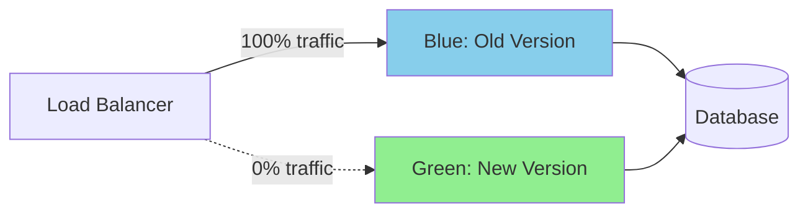
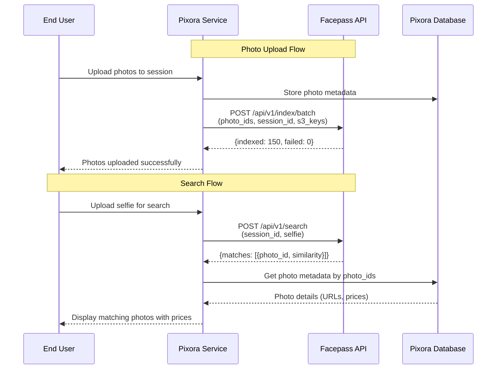

# Design Document: Facepass Microservice Isolation

## Overview

Данный документ описывает техническую архитектуру изолированного микросервиса распознавания лиц (Face Recognition Engine), который будет работать автономно без зависимостей от внешнего сервиса Pixora.

### Цели проектирования

1. **Автономность**: Сервис должен работать независимо, используя только собственную базу данных
2. **Простота API**: Чистый REST API для индексации и поиска по лицам
3. **Производительность**: Поиск в сессиях до 1000 фото за < 500ms
4. **Безопасность**: API key authentication и валидация входных данных
5. **Наблюдаемость**: Метрики, логирование, health checks

### Ключевые изменения

**Удаляется:**
- Подключение к Pixora БД (`pixora_engine`, `MAIN_APP_DATABASE_URL`)
- Подключение к Main БД (`main_engine`, таблицы `faces`, `events`)
- Автоматическая синхронизация с Pixora API
- CORS прокси эндпоинт `/api/v1/remote-services/{session_id}`
- Pixora-специфичная конфигурация (`MAIN_API_URL`, `DOMAIN`, etc.)

**Добавляется:**
- Упрощенная схема БД (только `face_embeddings`)
- Новый чистый API (`/api/v1/index`, `/api/v1/search`)
- API key authentication
- Prometheus метрики
- Structured logging

## Architecture

### High-Level Architecture



### Component Interaction Flow

**Indexing Flow:**


**Search Flow:**


## Components and Interfaces

### 1. API Layer

#### 1.1 Indexing Endpoints

**POST /api/v1/index**
```python
Request:
  Headers:
    X-API-Key: <api_key>
  Body (multipart/form-data):
    photo_id: str (UUID or timestamp-hash)
    session_id: str (UUID)
    image: file (optional, if not using s3_key)
    s3_key: str (optional, if image already in S3)

Response (200 OK):
  {
    "indexed": true,
    "photo_id": "550e8400-e29b-41d4-a716-446655440000",
    "confidence": 0.87,
    "faces_detected": 1
  }

Errors:
  400: No face detected, invalid image format
  401: Invalid or missing API key
  413: Image too large (> 10MB)
  500: Processing error
```

**POST /api/v1/index/batch**
```python
Request:
  Headers:
    X-API-Key: <api_key>
  Body (application/json):
    {
      "session_id": "uuid",
      "photos": [
        {"photo_id": "uuid-1", "s3_key": "path/to/photo1.jpg"},
        {"photo_id": "uuid-2", "s3_key": "path/to/photo2.jpg"}
      ]
    }

Response (200 OK):
  {
    "indexed": 15,
    "failed": 2,
    "errors": [
      {"photo_id": "uuid-3", "error": "No face detected"},
      {"photo_id": "uuid-5", "error": "Image not found in S3"}
    ]
  }
```

**DELETE /api/v1/index/{session_id}**
```python
Request:
  Headers:
    X-API-Key: <api_key>

Response (200 OK):
  {
    "deleted": true,
    "embeddings_removed": 150
  }

Errors:
  401: Invalid or missing API key
  404: Session not found
```

#### 1.2 Search Endpoints

**POST /api/v1/search**
```python
Request:
  Body (multipart/form-data):
    session_id: str (UUID)
    image: file (selfie)
    threshold: float = 0.5 (optional, 0.0-1.0)
    limit: int = 100 (optional, max results)

Response (200 OK):
  {
    "matches": [
      {
        "photo_id": "uuid-1",
        "similarity": 0.95,
        "confidence": 0.87
      },
      {
        "photo_id": "uuid-2",
        "similarity": 0.89,
        "confidence": 0.92
      }
    ],
    "query_time_ms": 123.45,
    "total_matches": 2
  }

Errors:
  400: No face in selfie, invalid image
  404: Session not indexed
  500: Search error
```

**GET /api/v1/search/status/{session_id}**
```python
Response (200 OK):
  {
    "indexed": true,
    "photo_count": 150,
    "last_indexed": "2024-01-15T10:30:00Z",
    "session_id": "uuid"
  }

Response (404 Not Found):
  {
    "indexed": false,
    "session_id": "uuid"
  }
```

#### 1.3 Health and Metrics

**GET /health**
```python
Response (200 OK):
  {
    "status": "healthy",
    "database": "connected",
    "face_recognition_model": "loaded",
    "version": "2.0.0",
    "uptime_seconds": 3600
  }

Response (503 Service Unavailable):
  {
    "status": "unhealthy",
    "database": "disconnected",
    "face_recognition_model": "loaded",
    "version": "2.0.0"
  }
```

**GET /metrics**
```python
# Prometheus format
facepass_search_requests_total{status="success"} 1234
facepass_search_requests_total{status="error"} 5
facepass_search_duration_seconds_bucket{le="0.1"} 800
facepass_search_duration_seconds_bucket{le="0.5"} 1200
facepass_index_requests_total 567
facepass_embeddings_total 15000
facepass_db_connections_active 5
```

### 2. Face Recognition Service

```python
class FaceRecognitionService:
    """
    Singleton service for face detection and embedding extraction.
    Uses InsightFace with buffalo_l model.
    """
    
    def __init__(self):
        self.app = FaceAnalysis(
            name='buffalo_l',
            providers=['CUDAExecutionProvider', 'CPUExecutionProvider']
        )
        self.app.prepare(ctx_id=0, det_size=(640, 640))
    
    def extract_single_embedding(
        self, 
        image_data: bytes
    ) -> Tuple[Optional[np.ndarray], float]:
        """
        Extract face embedding from image.
        
        Args:
            image_data: Raw image bytes
            
        Returns:
            (embedding, confidence) or (None, 0.0) if no face detected
            
        Raises:
            ValueError: Invalid image format
            RuntimeError: Face recognition error
        """
        
    def extract_multiple_embeddings(
        self,
        image_data: bytes
    ) -> List[Tuple[np.ndarray, float]]:
        """
        Extract all face embeddings from image (for group photos).
        
        Returns:
            List of (embedding, confidence) tuples
        """
    
    def calculate_similarity(
        self,
        embedding1: np.ndarray,
        embedding2: np.ndarray
    ) -> float:
        """
        Calculate cosine similarity between two embeddings.
        
        Returns:
            Similarity score (0.0 to 1.0)
        """
```

### 3. Indexing Service

```python
class IndexingService:
    """
    Service for indexing photos into vector database.
    """
    
    def index_photo(
        self,
        photo_id: str,
        session_id: str,
        image_data: bytes,
        db: Session
    ) -> IndexResult:
        """
        Index a single photo.
        
        Returns:
            IndexResult with success status and confidence
        """
    
    def index_batch(
        self,
        session_id: str,
        photos: List[PhotoToIndex],
        db: Session
    ) -> BatchIndexResult:
        """
        Index multiple photos in batch.
        
        Returns:
            BatchIndexResult with success/failure counts
        """
    
    def delete_session(
        self,
        session_id: str,
        db: Session
    ) -> int:
        """
        Delete all embeddings for a session.
        
        Returns:
            Number of embeddings deleted
        """
```

### 4. Search Service

```python
class SearchService:
    """
    Service for searching similar faces in vector database.
    """
    
    def search_session(
        self,
        session_id: str,
        query_embedding: np.ndarray,
        threshold: float,
        limit: int,
        db: Session
    ) -> List[SearchMatch]:
        """
        Search for similar faces in a session.
        
        Uses pgvector cosine distance operator (<=>).
        
        Returns:
            List of SearchMatch with photo_id and similarity
        """
    
    def get_session_status(
        self,
        session_id: str,
        db: Session
    ) -> SessionStatus:
        """
        Get indexing status for a session.
        
        Returns:
            SessionStatus with photo count and last indexed time
        """
```

### 5. Authentication Middleware

```python
class APIKeyAuth:
    """
    Middleware for API key authentication.
    """
    
    def __init__(self, api_keys: List[str]):
        self.api_keys = set(api_keys)
    
    async def __call__(
        self,
        request: Request,
        call_next
    ):
        """
        Validate API key from X-API-Key header.
        
        Protected endpoints:
        - POST /api/v1/index
        - POST /api/v1/index/batch
        - DELETE /api/v1/index/*
        
        Public endpoints:
        - POST /api/v1/search
        - GET /api/v1/search/status/*
        - GET /health
        - GET /metrics
        """
```

## Data Models

### Database Schema

**face_embeddings table (PostgreSQL + pgvector)**

```sql
CREATE TABLE face_embeddings (
    id SERIAL PRIMARY KEY,
    photo_id VARCHAR(255) NOT NULL,
    session_id VARCHAR(255) NOT NULL,
    embedding vector(512) NOT NULL,
    confidence FLOAT NOT NULL,
    created_at TIMESTAMP WITH TIME ZONE DEFAULT NOW(),
    
    -- Indexes for performance
    CONSTRAINT unique_photo_session UNIQUE (photo_id, session_id)
);

-- Indexes
CREATE INDEX idx_face_embeddings_session_id ON face_embeddings(session_id);
CREATE INDEX idx_face_embeddings_photo_id ON face_embeddings(photo_id);
CREATE INDEX idx_face_embeddings_session_photo ON face_embeddings(session_id, photo_id);

-- Vector index for similarity search (IVFFlat for large datasets)
CREATE INDEX idx_face_embeddings_vector ON face_embeddings 
USING ivfflat (embedding vector_cosine_ops)
WITH (lists = 100);
```

**Migration from old schema:**

```sql
-- Step 1: Backup existing data
CREATE TABLE face_embeddings_backup AS 
SELECT * FROM face_embeddings;

-- Step 2: Drop unused columns
ALTER TABLE face_embeddings DROP COLUMN IF EXISTS face_id;
ALTER TABLE face_embeddings DROP COLUMN IF EXISTS event_id;

-- Step 3: Add constraints
ALTER TABLE face_embeddings 
    ALTER COLUMN photo_id SET NOT NULL,
    ALTER COLUMN session_id SET NOT NULL;

-- Step 4: Add unique constraint
ALTER TABLE face_embeddings 
    ADD CONSTRAINT unique_photo_session UNIQUE (photo_id, session_id);

-- Step 5: Recreate indexes
DROP INDEX IF EXISTS idx_face_embeddings_face_id;
DROP INDEX IF EXISTS idx_face_embeddings_event_id;

CREATE INDEX idx_face_embeddings_session_id ON face_embeddings(session_id);
CREATE INDEX idx_face_embeddings_photo_id ON face_embeddings(photo_id);
CREATE INDEX idx_face_embeddings_session_photo ON face_embeddings(session_id, photo_id);

-- Step 6: Create vector index
CREATE INDEX idx_face_embeddings_vector ON face_embeddings 
USING ivfflat (embedding vector_cosine_ops)
WITH (lists = 100);
```

### Pydantic Models

```python
from pydantic import BaseModel, Field
from typing import List, Optional
from datetime import datetime

class IndexRequest(BaseModel):
    """Request model for single photo indexing."""
    photo_id: str = Field(..., description="Photo identifier (UUID or hash)")
    session_id: str = Field(..., description="Session identifier (UUID)")
    s3_key: Optional[str] = Field(None, description="S3 key if image in storage")

class IndexResponse(BaseModel):
    """Response model for indexing."""
    indexed: bool
    photo_id: str
    confidence: float
    faces_detected: int

class BatchIndexRequest(BaseModel):
    """Request model for batch indexing."""
    session_id: str
    photos: List[PhotoToIndex]

class PhotoToIndex(BaseModel):
    """Photo to index in batch."""
    photo_id: str
    s3_key: str

class BatchIndexResponse(BaseModel):
    """Response model for batch indexing."""
    indexed: int
    failed: int
    errors: List[IndexError]

class IndexError(BaseModel):
    """Error during indexing."""
    photo_id: str
    error: str

class SearchRequest(BaseModel):
    """Request model for search."""
    session_id: str
    threshold: float = Field(0.5, ge=0.0, le=1.0)
    limit: int = Field(100, ge=1, le=1000)

class SearchMatch(BaseModel):
    """Single search result."""
    photo_id: str
    similarity: float
    confidence: float

class SearchResponse(BaseModel):
    """Response model for search."""
    matches: List[SearchMatch]
    query_time_ms: float
    total_matches: int

class SessionStatus(BaseModel):
    """Session indexing status."""
    indexed: bool
    photo_count: int
    last_indexed: Optional[datetime]
    session_id: str

class HealthResponse(BaseModel):
    """Health check response."""
    status: str
    database: str
    face_recognition_model: str
    version: str
    uptime_seconds: int
```


## Configuration

### Environment Variables

**Required Configuration:**

```env
# Database (Vector Database only)
POSTGRES_USER=facepass
POSTGRES_PASSWORD=<secret>
POSTGRES_DB=facepass_vectors
POSTGRES_HOST=db_vector
POSTGRES_PORT=5432

# Redis (for caching and rate limiting)
REDIS_HOST=redis
REDIS_PORT=6379
REDIS_DB=0

# S3 Storage (optional - only if indexing from S3)
S3_ENDPOINT=https://s3.beget.com
S3_ACCESS_KEY=<key>
S3_SECRET_KEY=<secret>
S3_BUCKET=photos
S3_REGION=ru-1

# Face Recognition
FACE_DETECTION_THRESHOLD=0.6
FACE_SIMILARITY_THRESHOLD=0.5
EMBEDDING_DIMENSION=512

# API Authentication
API_KEYS=key1,key2,key3  # Comma-separated list

# Application
APP_NAME=FacePass
APP_VERSION=2.0.0
DEBUG=false
```

**Removed Configuration (Pixora-specific):**

```env
# These are NO LONGER NEEDED:
# MAIN_APP_DATABASE_URL
# MAIN_API_URL
# MAIN_URL
# DOMAIN
# STAGING_DOMAIN
# MAIN_DB_HOST
# MAIN_DB_PORT
```

### Configuration Validation

```python
class Settings(BaseSettings):
    """Simplified configuration for isolated microservice."""
    
    # Application
    APP_NAME: str = "FacePass"
    APP_VERSION: str = "2.0.0"
    DEBUG: bool = False
    
    # Database (Vector only)
    POSTGRES_USER: str
    POSTGRES_PASSWORD: str
    POSTGRES_DB: str
    POSTGRES_HOST: str = "db_vector"
    POSTGRES_PORT: int = 5432
    
    # Redis
    REDIS_HOST: str = "redis"
    REDIS_PORT: int = 6379
    REDIS_DB: int = 0
    
    # S3 (optional)
    S3_ENDPOINT: Optional[str] = None
    S3_ACCESS_KEY: Optional[str] = None
    S3_SECRET_KEY: Optional[str] = None
    S3_BUCKET: Optional[str] = None
    S3_REGION: str = "ru-1"
    
    # Face Recognition
    FACE_DETECTION_THRESHOLD: float = Field(default=0.6, ge=0.0, le=1.0)
    FACE_SIMILARITY_THRESHOLD: float = Field(default=0.5, ge=0.0, le=1.0)
    EMBEDDING_DIMENSION: int = 512
    
    # API Keys
    API_KEYS: str  # Comma-separated
    
    @property
    def database_url(self) -> str:
        return (
            f"postgresql://{self.POSTGRES_USER}:{self.POSTGRES_PASSWORD}"
            f"@{self.POSTGRES_HOST}:{self.POSTGRES_PORT}/{self.POSTGRES_DB}"
        )
    
    @property
    def api_keys_list(self) -> List[str]:
        return [k.strip() for k in self.API_KEYS.split(",")]
```


## Correctness Properties

*A property is a characteristic or behavior that should hold true across all valid executions of a system—essentially, a formal statement about what the system should do. Properties serve as the bridge between human-readable specifications and machine-verifiable correctness guarantees.*

### Property 1: Database Isolation

*For any* operation (indexing, searching, status check), the system should use only the Vector Database connection and should not create or use connections to external databases (Pixora DB, Main DB).

**Validates: Requirements 2.2, 2.3, 4.5, 6.1**

### Property 2: Search Without External Dependencies

*For any* search request with a valid session_id and selfie image, the system should return results using only data from the Vector Database without making any external API calls or database queries.

**Validates: Requirements 2.3, 4.1, 4.3**

### Property 3: Photo ID Format Support

*For any* photo_id in either UUID format or timestamp-hash format, the system should successfully index and search the photo without errors.

**Validates: Requirements 2.5**

### Property 4: API Response Format

*For any* successful indexing request, the response should contain only minimal fields (indexed, photo_id, confidence, faces_detected) and should not contain Pixora-specific data (prices, orders, cart information).

**Validates: Requirements 3.2, 3.6**

### Property 5: Search Response Format

*For any* successful search request, the response should contain an array of matches with photo_id and similarity scores, and should not contain Pixora-specific metadata.

**Validates: Requirements 3.4, 3.6**

### Property 6: No Background Sync Tasks

*For any* search request, the system should not trigger background synchronization tasks or make external API calls to fetch new photos.

**Validates: Requirements 4.1, 4.2**

### Property 7: Embedding Validation

*For all* embeddings stored in the database after migration, each embedding should be a valid 512-dimensional vector with a norm close to 1.0 (normalized).

**Validates: Requirements 5.2**

### Property 8: Single Database Operations

*For any* indexing operation, data should be written only to the Vector Database and not to any other database (Main DB faces table, events table).

**Validates: Requirements 6.2, 6.3, 6.4**

### Property 9: API Key Authentication

*For any* indexing or deletion request without a valid API key in the X-API-Key header, the system should return 401 Unauthorized.

**Validates: Requirements 8.1, 8.2, 8.3**

### Property 10: Invalid API Key Rejection

*For any* protected endpoint request with an invalid API key, the system should reject the request with 401 status code and should not process the operation.

**Validates: Requirements 8.2, 8.3**

### Property 11: Request Logging

*For any* API request (successful or failed), the system should create a structured log entry containing timestamp, endpoint, client identification (API key hash), and response status.

**Validates: Requirements 8.5, 9.3**

### Property 12: Performance Metrics Tracking

*For any* indexing or search operation, the system should update corresponding Prometheus metrics (request count, duration histogram).

**Validates: Requirements 9.4**

### Property 13: Search Performance Bound

*For any* search request in a session with up to 1000 indexed photos, the query should complete and return results within 500ms (p95 latency).

**Validates: Requirements 12.1**

### Property 14: Input Validation

*For any* API request with invalid input data (non-image file, missing required fields, out-of-range threshold), the system should reject the request with 400 Bad Request and appropriate error message.

**Validates: Requirements 15.1**

### Property 15: SQL Injection Prevention

*For any* input containing SQL injection attempts (e.g., photo_id with SQL commands), the system should safely handle the input using parameterized queries without executing malicious SQL.

**Validates: Requirements 15.2**

### Property 16: Rate Limiting

*For any* client making requests exceeding the configured rate limit (e.g., 100 requests/minute for indexing), subsequent requests should be rejected with 429 Too Many Requests.

**Validates: Requirements 15.3**

### Property 17: File Upload Validation

*For any* file upload that is not a valid image format or exceeds size limits (10MB), the system should reject the upload with 400 Bad Request or 413 Payload Too Large.

**Validates: Requirements 15.4**

### Property 18: Embedding Normalization

*For any* face embedding extracted from an image, the embedding should be normalized to unit length (L2 norm = 1.0) before storage.

**Validates: Requirements 5.2**

### Property 19: Similarity Symmetry

*For any* two embeddings A and B, the similarity score between A and B should equal the similarity score between B and A (cosine similarity is symmetric).

**Validates: Requirements 12.1** (correctness of similarity calculation)

### Property 20: Round-Trip Indexing

*For any* photo that is indexed and then searched using the same image, the photo should appear in search results with similarity score > 0.95.

**Validates: Requirements 3.2, 3.4** (correctness of indexing and search)

### Property 21: Session Isolation

*For any* search in session A, the results should only contain photo_ids from session A and should not include photos from other sessions.

**Validates: Requirements 2.1, 4.3** (data isolation)

### Property 22: Idempotent Indexing

*For any* photo_id and session_id combination, indexing the same photo multiple times should result in only one embedding record in the database (upsert behavior).

**Validates: Requirements 3.2** (data consistency)


## Error Handling

### Error Response Format

All errors follow a consistent JSON format:

```json
{
  "error": {
    "code": "ERROR_CODE",
    "message": "Human-readable error message",
    "details": {
      "field": "Additional context"
    }
  }
}
```

### Error Categories

#### 1. Client Errors (4xx)

**400 Bad Request**
- No face detected in image
- Invalid image format
- Missing required fields
- Invalid threshold value (not in 0.0-1.0 range)
- Invalid limit value

```json
{
  "error": {
    "code": "NO_FACE_DETECTED",
    "message": "No face detected in the uploaded image",
    "details": {
      "suggestion": "Ensure the image contains a clear, frontal face"
    }
  }
}
```

**401 Unauthorized**
- Missing API key
- Invalid API key

```json
{
  "error": {
    "code": "INVALID_API_KEY",
    "message": "Invalid or missing API key",
    "details": {
      "header": "X-API-Key"
    }
  }
}
```

**404 Not Found**
- Session not indexed
- Photo not found

```json
{
  "error": {
    "code": "SESSION_NOT_INDEXED",
    "message": "Session has no indexed photos",
    "details": {
      "session_id": "uuid",
      "suggestion": "Index photos first using POST /api/v1/index"
    }
  }
}
```

**413 Payload Too Large**
- Image exceeds 10MB limit

```json
{
  "error": {
    "code": "IMAGE_TOO_LARGE",
    "message": "Image size exceeds 10MB limit",
    "details": {
      "max_size_mb": 10
    }
  }
}
```

**429 Too Many Requests**
- Rate limit exceeded

```json
{
  "error": {
    "code": "RATE_LIMIT_EXCEEDED",
    "message": "Too many requests, please slow down",
    "details": {
      "limit": "100 requests per minute",
      "retry_after_seconds": 30
    }
  }
}
```

#### 2. Server Errors (5xx)

**500 Internal Server Error**
- Face recognition model error
- Database connection error
- Unexpected processing error

```json
{
  "error": {
    "code": "PROCESSING_ERROR",
    "message": "Failed to process image",
    "details": {
      "error_id": "uuid-for-tracking"
    }
  }
}
```

**503 Service Unavailable**
- Database unavailable
- Face recognition model not loaded

```json
{
  "error": {
    "code": "SERVICE_UNAVAILABLE",
    "message": "Service temporarily unavailable",
    "details": {
      "reason": "Database connection failed"
    }
  }
}
```

### Error Handling Strategy

1. **Validation Errors**: Caught early at API layer, return 400 with specific error message
2. **Authentication Errors**: Handled by middleware, return 401 immediately
3. **Business Logic Errors**: Caught in service layer, return appropriate 4xx code
4. **Infrastructure Errors**: Caught at top level, return 500 with error tracking ID
5. **All Errors**: Logged with structured logging including request context

### Logging Strategy

```python
import structlog

logger = structlog.get_logger()

# Success case
logger.info(
    "search_completed",
    session_id=session_id,
    matches_found=len(matches),
    query_time_ms=query_time,
    threshold=threshold
)

# Error case
logger.error(
    "search_failed",
    session_id=session_id,
    error_code="NO_FACE_DETECTED",
    error_message=str(e),
    exc_info=True
)
```


## Testing Strategy

### Dual Testing Approach

The testing strategy combines unit tests for specific cases and property-based tests for comprehensive coverage:

- **Unit tests**: Verify specific examples, edge cases, and error conditions
- **Property tests**: Verify universal properties across all inputs
- Both are complementary and necessary for comprehensive coverage

### 1. Unit Tests

Unit tests focus on specific examples and edge cases:

**Configuration Tests**
```python
def test_config_requires_postgres_credentials():
    """Test that missing database credentials raise validation error."""
    with pytest.raises(ValidationError):
        Settings(POSTGRES_USER="", POSTGRES_PASSWORD="")

def test_config_validates_threshold_range():
    """Test that threshold values outside 0.0-1.0 are rejected."""
    with pytest.raises(ValidationError):
        Settings(FACE_SIMILARITY_THRESHOLD=1.5)

def test_config_parses_api_keys():
    """Test that comma-separated API keys are parsed correctly."""
    settings = Settings(API_KEYS="key1,key2,key3")
    assert len(settings.api_keys_list) == 3
```

**Database Tests**
```python
def test_database_schema_has_minimal_fields():
    """Test that face_embeddings table has only required fields."""
    inspector = inspect(engine)
    columns = [c['name'] for c in inspector.get_columns('face_embeddings')]
    
    required = {'id', 'photo_id', 'session_id', 'embedding', 'confidence', 'created_at'}
    assert set(columns) == required

def test_no_external_database_engines():
    """Test that only vector database engine exists."""
    from core.database import engine
    
    # Should not have pixora_engine or main_engine
    assert not hasattr(database, 'pixora_engine')
    assert not hasattr(database, 'main_engine')
```

**API Tests**
```python
def test_index_endpoint_requires_api_key():
    """Test that indexing without API key returns 401."""
    response = client.post("/api/v1/index", data={...})
    assert response.status_code == 401

def test_search_endpoint_is_public():
    """Test that search works without API key."""
    response = client.post("/api/v1/search", data={...})
    assert response.status_code != 401

def test_health_endpoint_returns_status():
    """Test that /health returns expected structure."""
    response = client.get("/health")
    assert response.status_code == 200
    data = response.json()
    assert "status" in data
    assert "database" in data
    assert "version" in data
```

**Edge Cases**
```python
def test_index_with_no_face():
    """Test that image with no face returns 400."""
    response = client.post(
        "/api/v1/index",
        headers={"X-API-Key": "valid-key"},
        data={"photo_id": "test", "session_id": "test"},
        files={"image": landscape_image}
    )
    assert response.status_code == 400
    assert "NO_FACE_DETECTED" in response.json()["error"]["code"]

def test_search_with_empty_session():
    """Test that searching non-indexed session returns 404."""
    response = client.post(
        "/api/v1/search",
        data={"session_id": "non-existent"},
        files={"image": selfie}
    )
    assert response.status_code == 404
```

### 2. Property-Based Tests

Property tests verify universal properties across randomized inputs. Each test runs minimum 100 iterations.

**Configuration:** Using Hypothesis library for Python

```python
from hypothesis import given, strategies as st
import hypothesis.strategies as st
```

**Property Test 1: Database Isolation**
```python
@given(st.text(min_size=1, max_size=100))
@pytest.mark.property
def test_no_external_database_connections(session_id):
    """
    Property: For any session_id, search should not create external DB connections.
    
    Feature: facepass-microservice-isolation, Property 1: Database Isolation
    """
    # Mock external database to fail if accessed
    with patch('core.database.pixora_engine') as mock_pixora:
        mock_pixora.connect.side_effect = AssertionError("External DB accessed!")
        
        # Search should work without external DB
        response = client.post(
            "/api/v1/search",
            data={"session_id": session_id},
            files={"image": test_selfie}
        )
        
        # Should not have called external DB
        mock_pixora.connect.assert_not_called()
```

**Property Test 2: Photo ID Format Support**
```python
@given(
    photo_id=st.one_of(
        st.uuids().map(str),  # UUID format
        st.text(min_size=10, max_size=50, alphabet=st.characters(whitelist_categories=('Ll', 'Nd')))  # timestamp-hash
    )
)
@pytest.mark.property
def test_photo_id_format_support(photo_id):
    """
    Property: For any photo_id in UUID or hash format, indexing should succeed.
    
    Feature: facepass-microservice-isolation, Property 3: Photo ID Format Support
    """
    response = client.post(
        "/api/v1/index",
        headers={"X-API-Key": "valid-key"},
        data={"photo_id": photo_id, "session_id": "test-session"},
        files={"image": test_image_with_face}
    )
    
    assert response.status_code in [200, 400]  # 400 only if no face, not format error
    if response.status_code == 400:
        assert "INVALID_PHOTO_ID" not in response.json()["error"]["code"]
```

**Property Test 3: API Response Format**
```python
@given(
    photo_id=st.text(min_size=1, max_size=100),
    session_id=st.text(min_size=1, max_size=100)
)
@pytest.mark.property
def test_api_response_no_pixora_data(photo_id, session_id):
    """
    Property: For any successful indexing, response should not contain Pixora fields.
    
    Feature: facepass-microservice-isolation, Property 4: API Response Format
    """
    response = client.post(
        "/api/v1/index",
        headers={"X-API-Key": "valid-key"},
        data={"photo_id": photo_id, "session_id": session_id},
        files={"image": test_image_with_face}
    )
    
    if response.status_code == 200:
        data = response.json()
        
        # Should have these fields
        assert "indexed" in data
        assert "photo_id" in data
        assert "confidence" in data
        
        # Should NOT have Pixora fields
        pixora_fields = ["price", "order_id", "cart", "photographer_id", "studio_id"]
        for field in pixora_fields:
            assert field not in data
```

**Property Test 4: No Background Sync**
```python
@given(session_id=st.text(min_size=1, max_size=100))
@pytest.mark.property
def test_no_background_sync_on_search(session_id):
    """
    Property: For any search request, no background tasks should be triggered.
    
    Feature: facepass-microservice-isolation, Property 6: No Background Sync Tasks
    """
    with patch('fastapi.BackgroundTasks.add_task') as mock_add_task:
        response = client.post(
            "/api/v1/search",
            data={"session_id": session_id},
            files={"image": test_selfie}
        )
        
        # Should not have added any background tasks
        mock_add_task.assert_not_called()
```

**Property Test 5: Embedding Normalization**
```python
@given(st.binary(min_size=1000, max_size=100000))
@pytest.mark.property
def test_embedding_normalization(image_data):
    """
    Property: For all embeddings, the L2 norm should be 1.0 (normalized).
    
    Feature: facepass-microservice-isolation, Property 18: Embedding Normalization
    """
    from services.face_recognition import get_face_recognition_service
    import numpy as np
    
    service = get_face_recognition_service()
    
    try:
        embedding, confidence = service.extract_single_embedding(image_data)
        
        if embedding is not None:
            norm = np.linalg.norm(embedding)
            assert abs(norm - 1.0) < 0.01, f"Embedding not normalized: {norm}"
    except (ValueError, RuntimeError):
        # Invalid image is acceptable
        pass
```

**Property Test 6: Similarity Symmetry**
```python
@given(
    image_a=st.binary(min_size=1000, max_size=50000),
    image_b=st.binary(min_size=1000, max_size=50000)
)
@pytest.mark.property
def test_similarity_symmetry(image_a, image_b):
    """
    Property: For any two embeddings, similarity(A,B) == similarity(B,A).
    
    Feature: facepass-microservice-isolation, Property 19: Similarity Symmetry
    """
    service = get_face_recognition_service()
    
    try:
        emb_a, _ = service.extract_single_embedding(image_a)
        emb_b, _ = service.extract_single_embedding(image_b)
        
        if emb_a is not None and emb_b is not None:
            sim_ab = service.calculate_similarity(emb_a, emb_b)
            sim_ba = service.calculate_similarity(emb_b, emb_a)
            
            assert abs(sim_ab - sim_ba) < 0.001
    except (ValueError, RuntimeError):
        pass
```

**Property Test 7: Session Isolation**
```python
@given(
    session_a=st.text(min_size=1, max_size=50),
    session_b=st.text(min_size=1, max_size=50)
)
@pytest.mark.property
def test_session_isolation(session_a, session_b):
    """
    Property: For any two different sessions, search in A should not return photos from B.
    
    Feature: facepass-microservice-isolation, Property 21: Session Isolation
    """
    assume(session_a != session_b)
    
    # Index photo in session A
    client.post(
        "/api/v1/index",
        headers={"X-API-Key": "valid-key"},
        data={"photo_id": "photo-a", "session_id": session_a},
        files={"image": test_image_a}
    )
    
    # Index photo in session B
    client.post(
        "/api/v1/index",
        headers={"X-API-Key": "valid-key"},
        data={"photo_id": "photo-b", "session_id": session_b},
        files={"image": test_image_b}
    )
    
    # Search in session A
    response = client.post(
        "/api/v1/search",
        data={"session_id": session_a, "threshold": 0.0},
        files={"image": test_selfie}
    )
    
    if response.status_code == 200:
        matches = response.json()["matches"]
        photo_ids = [m["photo_id"] for m in matches]
        
        # Should not contain photo from session B
        assert "photo-b" not in photo_ids
```

**Property Test 8: SQL Injection Prevention**
```python
@given(
    malicious_input=st.one_of(
        st.just("'; DROP TABLE face_embeddings; --"),
        st.just("1' OR '1'='1"),
        st.just("admin'--"),
        st.just("' UNION SELECT * FROM face_embeddings--")
    )
)
@pytest.mark.property
def test_sql_injection_prevention(malicious_input):
    """
    Property: For any input with SQL injection attempts, system should handle safely.
    
    Feature: facepass-microservice-isolation, Property 15: SQL Injection Prevention
    """
    # Try SQL injection in photo_id
    response = client.post(
        "/api/v1/index",
        headers={"X-API-Key": "valid-key"},
        data={"photo_id": malicious_input, "session_id": "test"},
        files={"image": test_image}
    )
    
    # Should either succeed (treating as normal string) or fail with validation error
    # Should NOT execute SQL or crash
    assert response.status_code in [200, 400, 422]
    
    # Database should still be intact
    db = VectorSessionLocal()
    count = db.query(FaceEmbedding).count()
    assert count >= 0  # Database still accessible
```

### 3. Integration Tests

Integration tests verify end-to-end workflows:

```python
def test_full_indexing_and_search_workflow():
    """Test complete workflow: index photos, then search."""
    session_id = str(uuid.uuid4())
    
    # Index 3 photos
    for i in range(3):
        response = client.post(
            "/api/v1/index",
            headers={"X-API-Key": "valid-key"},
            data={"photo_id": f"photo-{i}", "session_id": session_id},
            files={"image": test_images[i]}
        )
        assert response.status_code == 200
    
    # Check status
    response = client.get(f"/api/v1/search/status/{session_id}")
    assert response.status_code == 200
    assert response.json()["photo_count"] == 3
    
    # Search
    response = client.post(
        "/api/v1/search",
        data={"session_id": session_id},
        files={"image": test_selfie}
    )
    assert response.status_code == 200
    assert len(response.json()["matches"]) > 0
```

### 4. Performance Tests

```python
@pytest.mark.performance
def test_search_performance_1000_photos():
    """Test that search in 1000-photo session completes within 500ms."""
    import time
    
    session_id = "perf-test-session"
    
    # Setup: Index 1000 photos (done once)
    # ... indexing code ...
    
    # Measure search time
    start = time.time()
    response = client.post(
        "/api/v1/search",
        data={"session_id": session_id},
        files={"image": test_selfie}
    )
    duration_ms = (time.time() - start) * 1000
    
    assert response.status_code == 200
    assert duration_ms < 500, f"Search took {duration_ms}ms, expected < 500ms"
```

### Test Configuration

**pytest.ini**
```ini
[pytest]
markers =
    property: Property-based tests (run with --hypothesis-seed=random)
    performance: Performance tests (run separately)
    integration: Integration tests

# Property test configuration
hypothesis_profile = default

[hypothesis]
max_examples = 100
deadline = 5000
```

### Coverage Goals

- Unit test coverage: > 80%
- Property test coverage: All correctness properties
- Integration test coverage: All major workflows
- Performance test coverage: Critical paths (search, indexing)


## Security

### 1. API Key Authentication

**Implementation:**
```python
from fastapi import Security, HTTPException
from fastapi.security import APIKeyHeader

api_key_header = APIKeyHeader(name="X-API-Key", auto_error=False)

async def verify_api_key(api_key: str = Security(api_key_header)):
    """Verify API key from header."""
    settings = get_settings()
    
    if not api_key:
        raise HTTPException(
            status_code=401,
            detail="Missing API key"
        )
    
    if api_key not in settings.api_keys_list:
        logger.warning("invalid_api_key_attempt", api_key_hash=hash(api_key))
        raise HTTPException(
            status_code=401,
            detail="Invalid API key"
        )
    
    return api_key
```

**Protected Endpoints:**
- POST /api/v1/index (requires API key)
- POST /api/v1/index/batch (requires API key)
- DELETE /api/v1/index/{session_id} (requires API key)

**Public Endpoints:**
- POST /api/v1/search (public)
- GET /api/v1/search/status/{session_id} (public)
- GET /health (public)
- GET /metrics (public, but can be restricted by network)

### 2. Rate Limiting

**Implementation using Redis:**
```python
from fastapi_limiter import FastAPILimiter
from fastapi_limiter.depends import RateLimiter

# Initialize on startup
@app.on_event("startup")
async def startup():
    redis = aioredis.from_url(settings.redis_url)
    await FastAPILimiter.init(redis)

# Apply to endpoints
@router.post("/index")
@limiter.limit("100/minute")  # Per API key
async def index_photo(...):
    pass

@router.post("/search")
@limiter.limit("1000/minute")  # Per IP
async def search(...):
    pass
```

**Rate Limits:**
- Indexing: 100 requests/minute per API key
- Batch indexing: 10 requests/minute per API key
- Search: 1000 requests/minute per IP
- Status check: 100 requests/minute per IP

### 3. Input Validation

**File Upload Validation:**
```python
from PIL import Image
import magic

def validate_image_upload(file: UploadFile) -> bytes:
    """Validate uploaded image file."""
    
    # Check content type
    if not file.content_type.startswith('image/'):
        raise HTTPException(400, "File must be an image")
    
    # Read file
    file_data = file.file.read()
    
    # Check size (max 10MB)
    if len(file_data) > 10 * 1024 * 1024:
        raise HTTPException(413, "Image too large (max 10MB)")
    
    # Verify actual file type (not just extension)
    file_type = magic.from_buffer(file_data, mime=True)
    if not file_type.startswith('image/'):
        raise HTTPException(400, "Invalid image file")
    
    # Verify image can be opened
    try:
        img = Image.open(io.BytesIO(file_data))
        img.verify()
    except Exception:
        raise HTTPException(400, "Corrupted image file")
    
    # Check dimensions (max 4096x4096)
    if img.width > 4096 or img.height > 4096:
        raise HTTPException(400, "Image dimensions too large (max 4096x4096)")
    
    return file_data
```

**Parameter Validation:**
```python
from pydantic import BaseModel, Field, validator

class SearchRequest(BaseModel):
    session_id: str = Field(..., min_length=1, max_length=255)
    threshold: float = Field(0.5, ge=0.0, le=1.0)
    limit: int = Field(100, ge=1, le=1000)
    
    @validator('session_id')
    def validate_session_id(cls, v):
        # Prevent SQL injection
        if any(c in v for c in ["'", '"', ';', '--', '/*', '*/']):
            raise ValueError("Invalid session_id format")
        return v
```

### 4. SQL Injection Prevention

**Always use parameterized queries:**
```python
# GOOD: Parameterized query
query = text("""
    SELECT photo_id, similarity
    FROM face_embeddings
    WHERE session_id = :session_id
    AND similarity >= :threshold
""")
result = db.execute(query, {"session_id": session_id, "threshold": threshold})

# BAD: String concatenation (NEVER DO THIS)
query = f"SELECT * FROM face_embeddings WHERE session_id = '{session_id}'"
```

**SQLAlchemy ORM automatically prevents SQL injection:**
```python
# Safe: ORM query
embeddings = db.query(FaceEmbedding).filter(
    FaceEmbedding.session_id == session_id
).all()
```

### 5. CORS Configuration

```python
from fastapi.middleware.cors import CORSMiddleware

app.add_middleware(
    CORSMiddleware,
    allow_origins=[
        "https://pixorasoft.ru",
        "https://staging.pixorasoft.ru"
    ],
    allow_credentials=True,
    allow_methods=["GET", "POST", "DELETE"],
    allow_headers=["X-API-Key", "Content-Type"],
    max_age=3600
)
```

### 6. Security Headers

```python
from fastapi.middleware.trustedhost import TrustedHostMiddleware
from starlette.middleware.base import BaseHTTPMiddleware

class SecurityHeadersMiddleware(BaseHTTPMiddleware):
    async def dispatch(self, request, call_next):
        response = await call_next(request)
        response.headers["X-Content-Type-Options"] = "nosniff"
        response.headers["X-Frame-Options"] = "DENY"
        response.headers["X-XSS-Protection"] = "1; mode=block"
        response.headers["Strict-Transport-Security"] = "max-age=31536000; includeSubDomains"
        return response

app.add_middleware(SecurityHeadersMiddleware)
```

### 7. Secrets Management

**Never commit secrets to git:**
```bash
# .env file (gitignored)
POSTGRES_PASSWORD=<secret>
S3_SECRET_KEY=<secret>
API_KEYS=<secret1>,<secret2>
```

**Use environment variables in production:**
```bash
# Docker secrets or Kubernetes secrets
docker secret create postgres_password /run/secrets/postgres_password
```


## Deployment Strategy

### Migration Phases

#### Phase 1: Preparation (Week 1)

**Goals:**
- Code review and testing
- Database migration scripts preparation
- Backup production data
- Setup staging environment

**Tasks:**
1. Code review of all changes
2. Run full test suite (unit + property + integration)
3. Create database migration scripts
4. Backup production `face_embeddings` table
5. Deploy to staging environment
6. Performance testing on staging

**Deliverables:**
- Tested codebase
- Migration scripts
- Database backup
- Staging deployment

#### Phase 2: Staging Validation (Week 2)

**Goals:**
- Validate new architecture on staging
- Performance testing with production-like data
- Integration testing with Pixora staging

**Tasks:**
1. Run database migration on staging
2. Verify data integrity after migration
3. Load testing (1000 concurrent searches)
4. Integration testing with Pixora staging API
5. Monitor metrics and logs
6. Fix any issues found

**Success Criteria:**
- All tests passing
- Search latency p95 < 500ms
- No data loss in migration
- Pixora integration working

#### Phase 3: Production Deployment (Week 3)

**Strategy: Blue-Green Deployment**



**Steps:**

1. **Deploy Green (New Version)**
   ```bash
   # Deploy new version alongside old
   docker-compose -f docker-compose.green.yml up -d
   
   # Run health checks
   curl http://green:8000/health
   ```

2. **Run Database Migration**
   ```bash
   # Connect to database
   psql -h db_vector -U facepass
   
   # Run migration script
   \i migration_v2.sql
   
   # Verify migration
   SELECT COUNT(*) FROM face_embeddings;
   SELECT COUNT(*) FROM face_embeddings WHERE photo_id IS NULL;
   ```

3. **Gradual Traffic Shift**
   ```bash
   # Shift 10% traffic to green
   nginx -s reload  # Update upstream weights
   
   # Monitor for 1 hour
   # Check metrics, logs, error rates
   
   # If OK, shift 50%
   # Monitor for 2 hours
   
   # If OK, shift 100%
   # Monitor for 24 hours
   ```

4. **Rollback Plan**
   ```bash
   # If issues detected, rollback immediately
   # Shift 100% traffic back to blue
   nginx -s reload
   
   # Restore database from backup if needed
   psql -h db_vector -U facepass < backup.sql
   ```

**Monitoring During Deployment:**
- Error rate (should stay < 0.1%)
- Search latency p95 (should stay < 500ms)
- Database connection pool usage
- Memory usage
- CPU usage

#### Phase 4: Cleanup (Week 4)

**Goals:**
- Remove legacy code and infrastructure
- Update documentation
- Decommission old version

**Tasks:**
1. Remove Pixora database connection code
2. Remove Main database connection code
3. Remove legacy endpoints
4. Update API documentation
5. Decommission blue (old) deployment
6. Archive old code

**Deliverables:**
- Clean codebase without legacy code
- Updated documentation
- Decommissioned old infrastructure

### Database Migration Script

**migration_v2.sql:**
```sql
-- Facepass Microservice Isolation - Database Migration
-- Version: 2.0.0
-- Date: 2024-01-15

BEGIN;

-- Step 1: Create backup table
CREATE TABLE face_embeddings_backup AS 
SELECT * FROM face_embeddings;

COMMENT ON TABLE face_embeddings_backup IS 'Backup before v2.0 migration';

-- Step 2: Verify data before migration
DO $$
DECLARE
    total_count INTEGER;
    null_session_count INTEGER;
BEGIN
    SELECT COUNT(*) INTO total_count FROM face_embeddings;
    SELECT COUNT(*) INTO null_session_count FROM face_embeddings WHERE session_id IS NULL;
    
    RAISE NOTICE 'Total embeddings: %', total_count;
    RAISE NOTICE 'Embeddings with NULL session_id: %', null_session_count;
    
    IF null_session_count > 0 THEN
        RAISE WARNING 'Found % embeddings with NULL session_id - these will be deleted', null_session_count;
    END IF;
END $$;

-- Step 3: Delete embeddings without session_id (legacy event-based data)
DELETE FROM face_embeddings WHERE session_id IS NULL;

-- Step 4: Drop unused columns
ALTER TABLE face_embeddings DROP COLUMN IF EXISTS face_id;
ALTER TABLE face_embeddings DROP COLUMN IF EXISTS event_id;

-- Step 5: Add NOT NULL constraints
ALTER TABLE face_embeddings 
    ALTER COLUMN photo_id SET NOT NULL,
    ALTER COLUMN session_id SET NOT NULL,
    ALTER COLUMN embedding SET NOT NULL,
    ALTER COLUMN confidence SET NOT NULL;

-- Step 6: Add unique constraint (prevent duplicates)
ALTER TABLE face_embeddings 
    ADD CONSTRAINT unique_photo_session UNIQUE (photo_id, session_id);

-- Step 7: Drop old indexes
DROP INDEX IF EXISTS idx_face_embeddings_face_id;
DROP INDEX IF EXISTS idx_face_embeddings_event_id;

-- Step 8: Create new indexes
CREATE INDEX IF NOT EXISTS idx_face_embeddings_session_id 
    ON face_embeddings(session_id);

CREATE INDEX IF NOT EXISTS idx_face_embeddings_photo_id 
    ON face_embeddings(photo_id);

CREATE INDEX IF NOT EXISTS idx_face_embeddings_session_photo 
    ON face_embeddings(session_id, photo_id);

-- Step 9: Create vector index for similarity search
-- Note: This may take several minutes for large datasets
CREATE INDEX IF NOT EXISTS idx_face_embeddings_vector 
    ON face_embeddings 
    USING ivfflat (embedding vector_cosine_ops)
    WITH (lists = 100);

-- Step 10: Verify migration
DO $$
DECLARE
    final_count INTEGER;
    backup_count INTEGER;
BEGIN
    SELECT COUNT(*) INTO final_count FROM face_embeddings;
    SELECT COUNT(*) INTO backup_count FROM face_embeddings_backup;
    
    RAISE NOTICE 'Migration complete';
    RAISE NOTICE 'Original count: %', backup_count;
    RAISE NOTICE 'Final count: %', final_count;
    RAISE NOTICE 'Deleted: %', backup_count - final_count;
END $$;

COMMIT;

-- Rollback script (if needed)
-- BEGIN;
-- DROP TABLE face_embeddings;
-- ALTER TABLE face_embeddings_backup RENAME TO face_embeddings;
-- COMMIT;
```

### Docker Compose Configuration

**docker-compose.yml (New Version):**
```yaml
version: '3.8'

services:
  facepass:
    build: .
    ports:
      - "8000:8000"
    environment:
      # Database (Vector only)
      POSTGRES_USER: ${POSTGRES_USER}
      POSTGRES_PASSWORD: ${POSTGRES_PASSWORD}
      POSTGRES_DB: ${POSTGRES_DB}
      POSTGRES_HOST: db_vector
      POSTGRES_PORT: 5432
      
      # Redis
      REDIS_HOST: redis
      REDIS_PORT: 6379
      
      # S3
      S3_ENDPOINT: ${S3_ENDPOINT}
      S3_ACCESS_KEY: ${S3_ACCESS_KEY}
      S3_SECRET_KEY: ${S3_SECRET_KEY}
      S3_BUCKET: ${S3_BUCKET}
      
      # Face Recognition
      FACE_DETECTION_THRESHOLD: 0.6
      FACE_SIMILARITY_THRESHOLD: 0.5
      
      # API Keys
      API_KEYS: ${API_KEYS}
    depends_on:
      - db_vector
      - redis
    healthcheck:
      test: ["CMD", "curl", "-f", "http://localhost:8000/health"]
      interval: 30s
      timeout: 10s
      retries: 3
      start_period: 40s
    restart: unless-stopped

  db_vector:
    image: pgvector/pgvector:pg16
    environment:
      POSTGRES_USER: ${POSTGRES_USER}
      POSTGRES_PASSWORD: ${POSTGRES_PASSWORD}
      POSTGRES_DB: ${POSTGRES_DB}
    volumes:
      - vector_data:/var/lib/postgresql/data
    ports:
      - "5432:5432"
    healthcheck:
      test: ["CMD-SHELL", "pg_isready -U ${POSTGRES_USER}"]
      interval: 10s
      timeout: 5s
      retries: 5
    restart: unless-stopped

  redis:
    image: redis:7-alpine
    ports:
      - "6379:6379"
    volumes:
      - redis_data:/data
    healthcheck:
      test: ["CMD", "redis-cli", "ping"]
      interval: 10s
      timeout: 5s
      retries: 5
    restart: unless-stopped

  prometheus:
    image: prom/prometheus:latest
    ports:
      - "9090:9090"
    volumes:
      - ./prometheus.yml:/etc/prometheus/prometheus.yml
      - prometheus_data:/prometheus
    command:
      - '--config.file=/etc/prometheus/prometheus.yml'
      - '--storage.tsdb.path=/prometheus'
    restart: unless-stopped

volumes:
  vector_data:
  redis_data:
  prometheus_data:
```

### Monitoring Setup

**prometheus.yml:**
```yaml
global:
  scrape_interval: 15s
  evaluation_interval: 15s

scrape_configs:
  - job_name: 'facepass'
    static_configs:
      - targets: ['facepass:8000']
    metrics_path: '/metrics'
```

### Health Check Configuration

**Kubernetes Readiness Probe:**
```yaml
readinessProbe:
  httpGet:
    path: /health
    port: 8000
  initialDelaySeconds: 30
  periodSeconds: 10
  timeoutSeconds: 5
  successThreshold: 1
  failureThreshold: 3

livenessProbe:
  httpGet:
    path: /health
    port: 8000
  initialDelaySeconds: 60
  periodSeconds: 30
  timeoutSeconds: 10
  failureThreshold: 3
```

### Rollback Procedure

**If issues are detected during deployment:**

1. **Immediate Actions:**
   ```bash
   # Shift all traffic back to old version
   kubectl set image deployment/facepass facepass=facepass:v1.0.0
   
   # Or with docker-compose
   docker-compose -f docker-compose.blue.yml up -d
   ```

2. **Database Rollback (if migration was run):**
   ```sql
   BEGIN;
   DROP TABLE face_embeddings;
   ALTER TABLE face_embeddings_backup RENAME TO face_embeddings;
   COMMIT;
   ```

3. **Verify Rollback:**
   ```bash
   # Check health
   curl http://facepass:8000/health
   
   # Check metrics
   curl http://facepass:8000/metrics | grep facepass_search
   
   # Test search
   curl -X POST http://facepass:8000/api/v1/search \
     -F "session_id=test" \
     -F "image=@selfie.jpg"
   ```

4. **Post-Rollback:**
   - Analyze logs to identify root cause
   - Fix issues in code
   - Re-test on staging
   - Schedule new deployment


## Integration with External Clients (Pixora)

### Client Responsibilities

После изоляции микросервиса, внешний клиент (Pixora) берет на себя следующие обязанности:

1. **Индексация фотографий**: Вызов `/api/v1/index` при загрузке новых фото
2. **Управление метаданными**: Хранение связи photo_id с бизнес-данными (цены, заказы)
3. **Предоставление UI**: Отображение результатов поиска пользователям
4. **Управление сессиями**: Создание и активация FacePass для сессий

### Integration Flow



### Pixora Integration Code Examples

**1. Indexing Photos After Upload**

```python
# Pixora backend code
import httpx

async def index_photos_in_facepass(session_id: str, photos: List[Photo]):
    """
    Index uploaded photos in Facepass after they are stored in Pixora.
    """
    facepass_url = "https://facepass.pixorasoft.ru/api/v1/index/batch"
    api_key = settings.FACEPASS_API_KEY
    
    # Prepare batch request
    photos_to_index = [
        {
            "photo_id": photo.id,
            "s3_key": photo.file_path
        }
        for photo in photos
    ]
    
    # Call Facepass API
    async with httpx.AsyncClient() as client:
        response = await client.post(
            facepass_url,
            headers={"X-API-Key": api_key},
            json={
                "session_id": session_id,
                "photos": photos_to_index
            },
            timeout=300.0  # 5 minutes for batch
        )
        
        if response.status_code == 200:
            result = response.json()
            logger.info(
                "facepass_indexing_complete",
                session_id=session_id,
                indexed=result["indexed"],
                failed=result["failed"]
            )
            return result
        else:
            logger.error(
                "facepass_indexing_failed",
                session_id=session_id,
                status_code=response.status_code,
                error=response.text
            )
            raise Exception(f"Facepass indexing failed: {response.text}")
```

**2. Searching Photos**

```python
# Pixora backend code
async def search_photos_by_selfie(session_id: str, selfie_data: bytes):
    """
    Search for photos in Facepass and enrich with Pixora metadata.
    """
    facepass_url = "https://facepass.pixorasoft.ru/api/v1/search"
    
    # Call Facepass API
    async with httpx.AsyncClient() as client:
        response = await client.post(
            facepass_url,
            data={"session_id": session_id, "threshold": 0.5, "limit": 100},
            files={"image": selfie_data},
            timeout=30.0
        )
        
        if response.status_code == 200:
            facepass_results = response.json()
            photo_ids = [m["photo_id"] for m in facepass_results["matches"]]
            
            # Enrich with Pixora metadata
            photos = await db.query(Photo).filter(
                Photo.id.in_(photo_ids)
            ).all()
            
            # Combine Facepass similarity with Pixora data
            enriched_results = []
            for match in facepass_results["matches"]:
                photo = next((p for p in photos if str(p.id) == match["photo_id"]), None)
                if photo:
                    enriched_results.append({
                        "photo_id": photo.id,
                        "similarity": match["similarity"],
                        "preview_url": photo.preview_url,
                        "full_url": photo.full_url,
                        "price": photo.price,
                        "photographer": photo.photographer.name
                    })
            
            return {
                "matches": enriched_results,
                "query_time_ms": facepass_results["query_time_ms"]
            }
        else:
            raise Exception(f"Facepass search failed: {response.text}")
```

**3. Webhook for Indexing Status (Optional)**

```python
# Pixora backend - webhook endpoint
@router.post("/webhooks/facepass/indexing-complete")
async def facepass_indexing_webhook(
    session_id: str,
    indexed: int,
    failed: int,
    webhook_secret: str = Header(...)
):
    """
    Receive notification from Facepass when batch indexing completes.
    """
    # Verify webhook secret
    if webhook_secret != settings.FACEPASS_WEBHOOK_SECRET:
        raise HTTPException(401, "Invalid webhook secret")
    
    # Update session status
    session = await db.query(PhotoSession).filter(
        PhotoSession.id == session_id
    ).first()
    
    if session:
        session.facepass_indexed_count = indexed
        session.facepass_failed_count = failed
        session.facepass_last_indexed = datetime.utcnow()
        await db.commit()
    
    return {"status": "ok"}
```

### API Key Management

**Pixora Configuration:**
```env
# Pixora .env file
FACEPASS_API_URL=https://facepass.pixorasoft.ru
FACEPASS_API_KEY=<secret-key-provided-by-facepass-admin>
FACEPASS_WEBHOOK_SECRET=<secret-for-webhook-verification>
```

**Facepass Configuration:**
```env
# Facepass .env file
API_KEYS=pixora-prod-key,pixora-staging-key,other-client-key
```

### Migration Guide for Pixora

**Step 1: Update Configuration**
```bash
# Add Facepass API credentials to Pixora .env
echo "FACEPASS_API_URL=https://facepass.pixorasoft.ru" >> .env
echo "FACEPASS_API_KEY=<provided-key>" >> .env
```

**Step 2: Update Photo Upload Flow**
```python
# Old code (automatic sync)
# No explicit indexing needed - Facepass auto-synced

# New code (explicit indexing)
async def upload_photos(session_id: str, photos: List[UploadFile]):
    # 1. Store photos in Pixora
    stored_photos = await store_photos_in_s3(photos)
    await save_photos_to_db(session_id, stored_photos)
    
    # 2. Index in Facepass
    await index_photos_in_facepass(session_id, stored_photos)
    
    return {"uploaded": len(stored_photos)}
```

**Step 3: Update Search Flow**
```python
# Old code (Facepass returned Pixora metadata)
# response = await facepass.search(session_id, selfie)
# # Response already had prices, URLs, etc.

# New code (enrich Facepass results with Pixora data)
async def search_photos(session_id: str, selfie: UploadFile):
    # 1. Search in Facepass (returns only photo_ids + similarity)
    facepass_results = await search_photos_by_selfie(session_id, selfie.file.read())
    
    # 2. Enrich with Pixora metadata
    # (already done in search_photos_by_selfie function)
    
    return facepass_results
```

**Step 4: Remove Legacy Code**
```python
# Remove these from Pixora:
# - Direct database connection to Facepass DB
# - CORS proxy endpoint to Facepass
# - Assumptions about Facepass auto-sync
```

### Backward Compatibility (Optional)

If gradual migration is needed, Facepass can provide a compatibility layer:

```python
# Facepass - legacy endpoint (deprecated)
@router.post("/api/v1/faces/search-session")
@deprecated(version="2.0.0", reason="Use /api/v1/search instead")
async def search_session_legacy(
    session_id: str = Form(...),
    file: UploadFile = File(...),
    background_tasks: BackgroundTasks = BackgroundTasks()
):
    """
    Legacy endpoint for backward compatibility.
    Logs deprecation warning and redirects to new endpoint.
    """
    logger.warning(
        "deprecated_endpoint_used",
        endpoint="/api/v1/faces/search-session",
        new_endpoint="/api/v1/search",
        session_id=session_id
    )
    
    # Redirect to new endpoint
    return await search_faces_in_session(
        session_id=session_id,
        file=file,
        threshold=None,
        limit=100,
        db=...,
        vector_db=...
    )
```

## Performance Optimization

### 1. Database Optimization

**Connection Pooling:**
```python
engine = create_engine(
    settings.database_url,
    pool_size=20,          # Max connections in pool
    max_overflow=10,       # Additional connections if pool full
    pool_pre_ping=True,    # Verify connections before use
    pool_recycle=3600      # Recycle connections after 1 hour
)
```

**Vector Index Tuning:**
```sql
-- For datasets < 10k vectors: use default
CREATE INDEX idx_vector ON face_embeddings 
USING ivfflat (embedding vector_cosine_ops);

-- For datasets > 10k vectors: tune lists parameter
-- Rule of thumb: lists = sqrt(total_rows)
CREATE INDEX idx_vector ON face_embeddings 
USING ivfflat (embedding vector_cosine_ops)
WITH (lists = 100);  -- For ~10k rows

-- For datasets > 100k vectors: consider HNSW index (PostgreSQL 16+)
CREATE INDEX idx_vector ON face_embeddings 
USING hnsw (embedding vector_cosine_ops)
WITH (m = 16, ef_construction = 64);
```

**Query Optimization:**
```sql
-- Ensure session_id filter is applied before vector search
EXPLAIN ANALYZE
SELECT photo_id, 1 - (embedding <=> '[...]') as similarity
FROM face_embeddings
WHERE session_id = 'uuid'  -- Filter first (uses B-tree index)
  AND (1 - (embedding <=> '[...]')) >= 0.5
ORDER BY similarity DESC
LIMIT 100;

-- Should show: Index Scan on idx_face_embeddings_session_id
--              -> Index Scan on idx_vector
```

### 2. Caching Strategy

**Redis Caching for Session Status:**
```python
import redis
from functools import wraps

redis_client = redis.from_url(settings.redis_url)

def cache_session_status(ttl=300):  # 5 minutes
    def decorator(func):
        @wraps(func)
        async def wrapper(session_id: str, *args, **kwargs):
            cache_key = f"session_status:{session_id}"
            
            # Try cache first
            cached = redis_client.get(cache_key)
            if cached:
                return json.loads(cached)
            
            # Compute and cache
            result = await func(session_id, *args, **kwargs)
            redis_client.setex(cache_key, ttl, json.dumps(result))
            
            return result
        return wrapper
    return decorator

@cache_session_status(ttl=300)
async def get_session_status(session_id: str, db: Session):
    # ... query database ...
    pass
```

### 3. Batch Processing

**Batch Embedding Extraction:**
```python
def extract_batch_embeddings(images: List[bytes]) -> List[Tuple[np.ndarray, float]]:
    """
    Extract embeddings for multiple images in one batch.
    More efficient than processing one-by-one.
    """
    results = []
    
    for image_data in images:
        # Process in batches of 10 for optimal GPU utilization
        if len(results) % 10 == 0 and len(results) > 0:
            # Flush batch to GPU
            pass
        
        embedding, confidence = extract_single_embedding(image_data)
        results.append((embedding, confidence))
    
    return results
```

### 4. Async Processing

**Async Database Queries:**
```python
from sqlalchemy.ext.asyncio import create_async_engine, AsyncSession

# Use async engine for better concurrency
async_engine = create_async_engine(
    settings.database_url.replace("postgresql://", "postgresql+asyncpg://"),
    pool_size=20
)

async def search_async(session_id: str, embedding: np.ndarray):
    async with AsyncSession(async_engine) as db:
        result = await db.execute(
            text("SELECT ... FROM face_embeddings WHERE ...")
        )
        return result.fetchall()
```

## Observability

### Structured Logging

```python
import structlog

# Configure structured logging
structlog.configure(
    processors=[
        structlog.stdlib.filter_by_level,
        structlog.stdlib.add_logger_name,
        structlog.stdlib.add_log_level,
        structlog.stdlib.PositionalArgumentsFormatter(),
        structlog.processors.TimeStamper(fmt="iso"),
        structlog.processors.StackInfoRenderer(),
        structlog.processors.format_exc_info,
        structlog.processors.UnicodeDecoder(),
        structlog.processors.JSONRenderer()
    ],
    context_class=dict,
    logger_factory=structlog.stdlib.LoggerFactory(),
    cache_logger_on_first_use=True,
)

logger = structlog.get_logger()

# Usage
logger.info(
    "search_completed",
    session_id=session_id,
    matches_found=len(matches),
    query_time_ms=query_time,
    threshold=threshold,
    user_ip=request.client.host
)
```

### Prometheus Metrics

```python
from prometheus_client import Counter, Histogram, Gauge

# Define metrics
search_requests = Counter(
    'facepass_search_requests_total',
    'Total search requests',
    ['status']  # success, error, no_face
)

search_duration = Histogram(
    'facepass_search_duration_seconds',
    'Search request duration',
    buckets=[0.1, 0.25, 0.5, 1.0, 2.5, 5.0]
)

index_requests = Counter(
    'facepass_index_requests_total',
    'Total indexing requests',
    ['status']
)

embeddings_total = Gauge(
    'facepass_embeddings_total',
    'Total embeddings in database'
)

db_connections = Gauge(
    'facepass_db_connections_active',
    'Active database connections'
)

# Usage in endpoints
@router.post("/search")
async def search(...):
    with search_duration.time():
        try:
            result = await perform_search(...)
            search_requests.labels(status='success').inc()
            return result
        except NoFaceDetected:
            search_requests.labels(status='no_face').inc()
            raise
        except Exception:
            search_requests.labels(status='error').inc()
            raise
```

### Grafana Dashboard

**Key Metrics to Monitor:**
- Request rate (requests/second)
- Error rate (errors/total requests)
- Search latency (p50, p95, p99)
- Database connection pool usage
- Embedding count growth
- Memory usage
- CPU usage

## Summary

Данный design документ описывает полную архитектуру изолированного микросервиса Facepass:

**Ключевые изменения:**
- Удалены все зависимости от Pixora (БД, API, синхронизация)
- Упрощена схема БД (только `face_embeddings`)
- Создан чистый REST API для индексации и поиска
- Добавлена аутентификация через API keys
- Реализованы метрики и логирование

**Архитектурные решения:**
- Singleton Face Recognition Service для эффективного использования памяти
- PostgreSQL + pgvector для векторного поиска
- Redis для кэширования и rate limiting
- Prometheus для метрик
- Structured logging для observability

**Correctness Properties:**
- 22 свойства корректности для валидации изоляции
- Property-based тесты с Hypothesis (100+ итераций)
- Unit тесты для edge cases
- Integration тесты для end-to-end workflows

**Deployment Strategy:**
- Blue-green deployment для zero-downtime
- Поэтапная миграция БД с rollback capability
- Мониторинг на каждом этапе

**Integration:**
- Pixora берет на себя индексацию и обогащение метаданными
- Facepass предоставляет только векторный поиск
- Четкое разделение ответственности

Следующий шаг: создание tasks документа для реализации.

