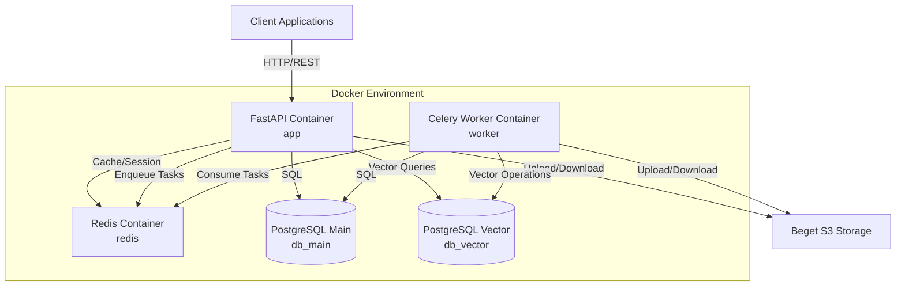

# Design Document: Fecapass Docker Architecture

## Overview

Fecapass Docker Architecture представляет собой микросервисную архитектуру для сервиса распознавания лиц, построенную на основе Docker контейнеров. Система использует FastAPI для REST API, PostgreSQL для хранения данных (основная БД и векторная БД с pgvector), Redis для кэширования и очередей Celery, а также Beget S3 для хранения изображений.

Архитектура спроектирована с учетом модульности, масштабируемости и простоты расширения функциональности.

## Architecture

### High-Level Architecture



### Container Architecture

Система состоит из 5 основных контейнеров:

1. **db_main** - PostgreSQL 16 для основных данных (пользователи, метаданные, логи)
2. **db_vector** - PostgreSQL с pgvector для векторных представлений лиц
3. **redis** - Redis для кэширования и Celery broker
4. **app** - FastAPI приложение для REST API
5. **worker** - Celery workers для асинхронной обработки изображений

### Network Architecture

Все контейнеры находятся в одной Docker сети `fecapass-network`, что обеспечивает:
- Изоляцию от внешних сетей
- Внутреннее DNS разрешение по именам контейнеров
- Безопасную коммуникацию между сервисами

Только контейнер `app` экспонирует порт наружу (8000) для доступа к API.

## Components and Interfaces

### 1. Docker Compose Configuration

**File:** `docker-compose.yml`

**Services:**

```yaml
services:
  db_main:
    image: postgres:16
    environment:
      - POSTGRES_DB
      - POSTGRES_USER
      - POSTGRES_PASSWORD
    volumes:
      - main_db_data:/var/lib/postgresql/data
    healthcheck:
      test: ["CMD-SHELL", "pg_isready -U ${POSTGRES_USER}"]
      interval: 5s
      timeout: 5s
      retries: 5

  db_vector:
    image: ankane/pgvector:latest
    environment:
      - POSTGRES_DB
      - POSTGRES_USER
      - POSTGRES_PASSWORD
    volumes:
      - vector_db_data:/var/lib/postgresql/data
    healthcheck:
      test: ["CMD-SHELL", "pg_isready -U ${POSTGRES_USER}"]
      interval: 5s
      timeout: 5s
      retries: 5

  redis:
    image: redis:7-alpine
    command: redis-server --appendonly yes
    volumes:
      - redis_data:/data
    healthcheck:
      test: ["CMD", "redis-cli", "ping"]
      interval: 5s
      timeout: 3s
      retries: 5

  app:
    build:
      context: .
      dockerfile: Dockerfile
    command: uvicorn app.main:app --host 0.0.0.0 --port 8000 --reload
    ports:
      - "8000:8000"
    volumes:
      - .:/code
    depends_on:
      db_main:
        condition: service_healthy
      db_vector:
        condition: service_healthy
      redis:
        condition: service_healthy
    env_file:
      - .env

  worker:
    build:
      context: .
      dockerfile: Dockerfile
    command: celery -A workers.celery_app worker --loglevel=info
    volumes:
      - .:/code
    depends_on:
      db_main:
        condition: service_healthy
      db_vector:
        condition: service_healthy
      redis:
        condition: service_healthy
    env_file:
      - .env

volumes:
  main_db_data:
  vector_db_data:
  redis_data:

networks:
  default:
    name: fecapass-network
```

### 2. Project Structure

```
fecapass/
├── app/
│   ├── __init__.py
│   ├── main.py              # FastAPI application entry point
│   ├── api/
│   │   ├── __init__.py
│   │   ├── v1/
│   │   │   ├── __init__.py
│   │   │   ├── endpoints/
│   │   │   │   ├── __init__.py
│   │   │   │   ├── faces.py      # Face recognition endpoints
│   │   │   │   └── health.py     # Health check endpoints
│   │   │   └── router.py
│   │   └── deps.py          # API dependencies (DB sessions, etc.)
│   └── schemas/             # Pydantic request/response schemas
│       ├── __init__.py
│       └── face.py
│
├── core/
│   ├── __init__.py
│   ├── config.py            # Configuration management
│   ├── database.py          # Database connections and sessions
│   └── s3.py                # S3 client initialization
│
├── services/
│   ├── __init__.py
│   ├── face_recognition.py  # Face detection and embedding extraction
│   ├── vector_search.py     # Vector similarity search
│   └── image_processing.py  # Image preprocessing
│
├── workers/
│   ├── __init__.py
│   ├── celery_app.py        # Celery application configuration
│   └── tasks.py             # Celery task definitions
│
├── models/
│   ├── __init__.py
│   ├── face.py              # SQLAlchemy models for faces
│   └── user.py              # SQLAlchemy models for users
│
├── scripts/
│   ├── __init__.py
│   └── init_db.py           # Database initialization script
│
├── docker-compose.yml
├── Dockerfile
├── requirements.txt
├── .env.example
└── .gitignore
```

### 3. Dockerfile

**File:** `Dockerfile`

```dockerfile
FROM python:3.11-slim

WORKDIR /code

# Install system dependencies for face recognition libraries
RUN apt-get update && apt-get install -y \
    libgl1-mesa-glx \
    libglib2.0-0 \
    libsm6 \
    libxext6 \
    libxrender-dev \
    libgomp1 \
    && rm -rf /var/lib/apt/lists/*

# Copy requirements and install Python dependencies
COPY requirements.txt .
RUN pip install --no-cache-dir -r requirements.txt

# Copy application code
COPY . .

# Create non-root user for security
RUN useradd -m -u 1000 appuser && chown -R appuser:appuser /code
USER appuser

# Default command (overridden in docker-compose.yml)
CMD ["uvicorn", "app.main:app", "--host", "0.0.0.0", "--port", "8000"]
```

### 4. Configuration Management

**File:** `core/config.py`

```python
from pydantic_settings import BaseSettings
from functools import lru_cache


class Settings(BaseSettings):
    # Application
    APP_NAME: str = "Fecapass"
    APP_VERSION: str = "1.0.0"
    DEBUG: bool = False
    
    # Database - Main
    POSTGRES_USER: str
    POSTGRES_PASSWORD: str
    POSTGRES_DB: str
    MAIN_DB_HOST: str = "db_main"
    MAIN_DB_PORT: int = 5432
    
    # Database - Vector
    VECTOR_DB_HOST: str = "db_vector"
    VECTOR_DB_PORT: int = 5432
    VECTOR_POSTGRES_DB: str
    
    # Redis
    REDIS_HOST: str = "redis"
    REDIS_PORT: int = 6379
    REDIS_DB: int = 0
    
    # Celery
    CELERY_BROKER_URL: str = None
    CELERY_RESULT_BACKEND: str = None
    
    # S3 Storage
    S3_ENDPOINT: str
    S3_ACCESS_KEY: str
    S3_SECRET_KEY: str
    S3_BUCKET: str
    S3_REGION: str = "ru-1"
    
    # Face Recognition
    FACE_DETECTION_THRESHOLD: float = 0.6
    FACE_SIMILARITY_THRESHOLD: float = 0.7
    EMBEDDING_DIMENSION: int = 512
    
    class Config:
        env_file = ".env"
        case_sensitive = True
    
    @property
    def main_database_url(self) -> str:
        return f"postgresql://{self.POSTGRES_USER}:{self.POSTGRES_PASSWORD}@{self.MAIN_DB_HOST}:{self.MAIN_DB_PORT}/{self.POSTGRES_DB}"
    
    @property
    def vector_database_url(self) -> str:
        return f"postgresql://{self.POSTGRES_USER}:{self.POSTGRES_PASSWORD}@{self.VECTOR_DB_HOST}:{self.VECTOR_DB_PORT}/{self.VECTOR_POSTGRES_DB}"
    
    @property
    def redis_url(self) -> str:
        return f"redis://{self.REDIS_HOST}:{self.REDIS_PORT}/{self.REDIS_DB}"
    
    def get_celery_broker_url(self) -> str:
        return self.CELERY_BROKER_URL or self.redis_url
    
    def get_celery_result_backend(self) -> str:
        return self.CELERY_RESULT_BACKEND or self.redis_url


@lru_cache()
def get_settings() -> Settings:
    return Settings()
```

**Interface:**
- `get_settings()` - Singleton function returning configuration instance
- All configuration accessed through Settings object properties
- Automatic validation via Pydantic
- Environment variable loading from .env file

### 5. Database Connections

**File:** `core/database.py`

```python
from sqlalchemy import create_engine
from sqlalchemy.ext.declarative import declarative_base
from sqlalchemy.orm import sessionmaker
from core.config import get_settings

settings = get_settings()

# Main Database Engine
main_engine = create_engine(
    settings.main_database_url,
    pool_pre_ping=True,
    pool_size=10,
    max_overflow=20
)

MainSessionLocal = sessionmaker(autocommit=False, autoflush=False, bind=main_engine)

# Vector Database Engine
vector_engine = create_engine(
    settings.vector_database_url,
    pool_pre_ping=True,
    pool_size=10,
    max_overflow=20
)

VectorSessionLocal = sessionmaker(autocommit=False, autoflush=False, bind=vector_engine)

# Base class for models
Base = declarative_base()


def get_main_db():
    """Dependency for main database session"""
    db = MainSessionLocal()
    try:
        yield db
    finally:
        db.close()


def get_vector_db():
    """Dependency for vector database session"""
    db = VectorSessionLocal()
    try:
        yield db
    finally:
        db.close()
```

**Interface:**
- `get_main_db()` - Generator yielding main database session
- `get_vector_db()` - Generator yielding vector database session
- Connection pooling configured for performance
- Automatic session cleanup

### 6. S3 Client

**File:** `core/s3.py`

```python
import boto3
from botocore.client import Config
from core.config import get_settings

settings = get_settings()


def get_s3_client():
    """Create and return S3 client for Beget storage"""
    return boto3.client(
        's3',
        endpoint_url=settings.S3_ENDPOINT,
        aws_access_key_id=settings.S3_ACCESS_KEY,
        aws_secret_access_key=settings.S3_SECRET_KEY,
        region_name=settings.S3_REGION,
        config=Config(signature_version='s3v4')
    )


def upload_image(file_data: bytes, object_name: str) -> str:
    """
    Upload image to S3 bucket
    
    Args:
        file_data: Image binary data
        object_name: Object key in S3 bucket
    
    Returns:
        URL of uploaded object
    """
    s3_client = get_s3_client()
    s3_client.put_object(
        Bucket=settings.S3_BUCKET,
        Key=object_name,
        Body=file_data,
        ContentType='image/jpeg'
    )
    return f"{settings.S3_ENDPOINT}/{settings.S3_BUCKET}/{object_name}"


def download_image(object_name: str) -> bytes:
    """
    Download image from S3 bucket
    
    Args:
        object_name: Object key in S3 bucket
    
    Returns:
        Image binary data
    """
    s3_client = get_s3_client()
    response = s3_client.get_object(
        Bucket=settings.S3_BUCKET,
        Key=object_name
    )
    return response['Body'].read()
```

**Interface:**
- `get_s3_client()` - Returns configured boto3 S3 client
- `upload_image(file_data, object_name)` - Uploads image, returns URL
- `download_image(object_name)` - Downloads image, returns bytes

### 7. Database Initialization Script

**File:** `scripts/init_db.py`

```python
import sys
import logging
from sqlalchemy import text
from core.database import vector_engine, main_engine, Base
from core.config import get_settings

logging.basicConfig(level=logging.INFO)
logger = logging.getLogger(__name__)

settings = get_settings()


def init_vector_extension():
    """Initialize pgvector extension in vector database"""
    try:
        with vector_engine.connect() as conn:
            conn.execute(text("CREATE EXTENSION IF NOT EXISTS vector"))
            conn.commit()
            logger.info("✓ pgvector extension initialized successfully")
    except Exception as e:
        logger.error(f"✗ Failed to initialize pgvector extension: {e}")
        sys.exit(1)


def create_tables():
    """Create all tables in both databases"""
    try:
        Base.metadata.create_all(bind=main_engine)
        logger.info("✓ Main database tables created successfully")
        
        Base.metadata.create_all(bind=vector_engine)
        logger.info("✓ Vector database tables created successfully")
    except Exception as e:
        logger.error(f"✗ Failed to create tables: {e}")
        sys.exit(1)


def main():
    logger.info("Starting database initialization...")
    init_vector_extension()
    create_tables()
    logger.info("Database initialization completed successfully")


if __name__ == "__main__":
    main()
```

**Interface:**
- `init_vector_extension()` - Enables pgvector extension
- `create_tables()` - Creates all SQLAlchemy tables
- `main()` - Orchestrates initialization process
- Exit code 0 on success, 1 on failure

### 8. Celery Configuration

**File:** `workers/celery_app.py`

```python
from celery import Celery
from core.config import get_settings

settings = get_settings()

celery_app = Celery(
    "fecapass",
    broker=settings.get_celery_broker_url(),
    backend=settings.get_celery_result_backend(),
    include=['workers.tasks']
)

celery_app.conf.update(
    task_serializer='json',
    accept_content=['json'],
    result_serializer='json',
    timezone='UTC',
    enable_utc=True,
    task_track_started=True,
    task_time_limit=300,  # 5 minutes
    task_soft_time_limit=240,  # 4 minutes
)
```

**Interface:**
- `celery_app` - Configured Celery application instance
- Task discovery from `workers.tasks` module
- JSON serialization for task arguments and results
- Timeout configuration for long-running tasks

## Data Models

### Main Database Models

**File:** `models/user.py`

```python
from sqlalchemy import Column, Integer, String, DateTime, Boolean
from sqlalchemy.sql import func
from core.database import Base


class User(Base):
    __tablename__ = "users"
    __table_args__ = {'schema': 'public'}
    
    id = Column(Integer, primary_key=True, index=True)
    email = Column(String, unique=True, index=True, nullable=False)
    full_name = Column(String, nullable=True)
    is_active = Column(Boolean, default=True)
    created_at = Column(DateTime(timezone=True), server_default=func.now())
    updated_at = Column(DateTime(timezone=True), onupdate=func.now())
```

**File:** `models/face.py`

```python
from sqlalchemy import Column, Integer, String, DateTime, ForeignKey, Float
from sqlalchemy.sql import func
from sqlalchemy.orm import relationship
from pgvector.sqlalchemy import Vector
from core.database import Base
from core.config import get_settings

settings = get_settings()


class Face(Base):
    __tablename__ = "faces"
    __table_args__ = {'schema': 'public'}
    
    id = Column(Integer, primary_key=True, index=True)
    user_id = Column(Integer, ForeignKey('users.id'), nullable=False)
    image_url = Column(String, nullable=False)
    s3_key = Column(String, nullable=False)
    confidence = Column(Float, nullable=False)
    created_at = Column(DateTime(timezone=True), server_default=func.now())
    
    # Relationship
    user = relationship("User", backref="faces")


class FaceEmbedding(Base):
    """Stored in vector database"""
    __tablename__ = "face_embeddings"
    __table_args__ = {'schema': 'public'}
    
    id = Column(Integer, primary_key=True, index=True)
    face_id = Column(Integer, nullable=False, index=True)
    embedding = Column(Vector(settings.EMBEDDING_DIMENSION), nullable=False)
    created_at = Column(DateTime(timezone=True), server_default=func.now())
```

### Pydantic Schemas

**File:** `app/schemas/face.py`

```python
from pydantic import BaseModel, Field
from datetime import datetime
from typing import Optional


class FaceUploadRequest(BaseModel):
    user_id: int
    

class FaceUploadResponse(BaseModel):
    face_id: int
    image_url: str
    confidence: float
    task_id: str  # Celery task ID for async processing
    

class FaceSearchRequest(BaseModel):
    threshold: Optional[float] = Field(default=0.7, ge=0.0, le=1.0)
    limit: Optional[int] = Field(default=10, ge=1, le=100)


class FaceSearchResult(BaseModel):
    face_id: int
    user_id: int
    similarity: float
    image_url: str
    

class FaceSearchResponse(BaseModel):
    results: list[FaceSearchResult]
    query_time_ms: float
```

## Correctness Properties


*Свойство (property) - это характеристика или поведение, которое должно выполняться во всех допустимых сценариях работы системы. По сути, это формальное утверждение о том, что система должна делать. Свойства служат мостом между человекочитаемыми спецификациями и машинно-проверяемыми гарантиями корректности.*

### Property 1: Docker Compose Service Configuration Completeness

*For any* valid Fecapass deployment, the docker-compose.yml file should define all five required services (db_main with postgres:16, db_vector with ankane/pgvector:latest, redis, app, worker) with correct images and configurations.

**Validates: Requirements 1.1, 1.2, 1.3, 1.4, 1.5**

### Property 2: Container Dependency Parity

*For any* pair of containers (app and worker), both should have access to identical Python dependencies by using the same Dockerfile and requirements.txt.

**Validates: Requirements 1.6**

### Property 3: Database Volume Persistence

*For any* database service (db_main, db_vector) in docker-compose.yml, a named volume should be configured and mounted to ensure data persistence.

**Validates: Requirements 1.7**

### Property 4: API Port Exposure

*For any* deployment configuration, the app service should expose port 8000 to allow external HTTP access to the FastAPI application.

**Validates: Requirements 1.9**

### Property 5: Project Directory Structure Completeness

*For any* valid Fecapass project, all five required directories (/app, /core, /services, /workers, /models) should exist in the project root.

**Validates: Requirements 2.1, 2.2, 2.3, 2.4, 2.5**

### Property 6: Python Dependencies Completeness

*For any* valid requirements.txt file, it should contain all 11 required packages: fastapi, uvicorn, sqlalchemy, pgvector, boto3, insightface, onnxruntime, celery, redis, psycopg2-binary, and python-dotenv.

**Validates: Requirements 3.1, 3.2, 3.3, 3.4, 3.5, 3.6, 3.7, 3.8, 3.9, 3.10, 3.11**

### Property 7: Configuration Attribute Completeness

*For any* Settings class instance, it should have attributes for all required configuration parameters: S3_KEY, S3_SECRET, S3_ENDPOINT, S3_BUCKET, MAIN_DB_URL, VECTOR_DB_URL, REDIS_URL, and CELERY_BROKER_URL.

**Validates: Requirements 4.2, 4.3, 4.4, 4.5, 4.6, 4.7, 4.8, 4.9**

### Property 8: Configuration Default Values

*For any* non-sensitive configuration parameter in the Settings class, it should have a default value defined to allow the system to function with minimal configuration.

**Validates: Requirements 4.10**

### Property 9: Configuration Validation

*For any* attempt to instantiate Settings without required parameters, Pydantic should raise a ValidationError, ensuring all required configuration is present.

**Validates: Requirements 4.11**

### Property 10: Service Health Check Dependencies

*For any* service with dependencies (app, worker) in docker-compose.yml, it should have depends_on configuration with health check conditions for all its dependencies (databases and redis).

**Validates: Requirements 7.1, 7.2, 7.3, 7.4, 7.5**

### Property 11: Environment Template Documentation

*For any* configuration variable in .env.example, it should be accompanied by a comment explaining its purpose, ensuring developers understand what each variable controls.

**Validates: Requirements 8.6**

## Error Handling

### Configuration Errors

**Missing Environment Variables:**
- System should fail fast at startup if required environment variables are missing
- Pydantic validation provides clear error messages indicating which variables are missing
- Application should not start in an invalid state

**Database Connection Failures:**
- Connection pool configured with `pool_pre_ping=True` to detect stale connections
- Automatic retry logic for transient connection failures
- Health checks in docker-compose ensure databases are ready before app starts
- Clear error logging with connection details (excluding passwords)

**S3 Connection Failures:**
- boto3 client should raise clear exceptions for authentication failures
- Timeout configuration to prevent hanging requests
- Retry logic with exponential backoff for transient failures
- Validation of S3 credentials at application startup

### Runtime Errors

**Face Detection Failures:**
- If no face detected in image, return clear error message to client
- Log detection failures for monitoring
- Return HTTP 422 with descriptive error message

**Vector Search Errors:**
- Handle empty result sets gracefully
- Validate embedding dimensions match configured size
- Return HTTP 500 for database errors with generic message (log details internally)

**Celery Task Failures:**
- Tasks should have retry logic with exponential backoff
- Maximum retry attempts configured (default: 3)
- Failed tasks logged with full context for debugging
- Task status queryable via task_id

### Validation Errors

**Input Validation:**
- Pydantic schemas validate all API inputs
- Return HTTP 422 with detailed validation errors
- Sanitize file uploads (size limits, type validation)

**Database Constraint Violations:**
- Catch unique constraint violations (duplicate emails)
- Return HTTP 409 Conflict with clear message
- Foreign key violations return HTTP 400 Bad Request

## Testing Strategy

### Unit Testing

Unit tests focus on specific components and edge cases:

**Configuration Tests:**
- Test Settings class loads environment variables correctly
- Test default values are applied when optional variables missing
- Test validation errors raised for missing required variables
- Test database URL construction from components

**Database Tests:**
- Test session creation and cleanup
- Test connection pool configuration
- Mock database to test error handling

**S3 Client Tests:**
- Test S3 client initialization with correct credentials
- Mock boto3 to test upload/download functions
- Test error handling for failed uploads

**Model Tests:**
- Test SQLAlchemy model definitions
- Test Pydantic schema validation
- Test schema serialization/deserialization

### Property-Based Testing

Property tests verify universal correctness properties across all inputs. Each property test should run a minimum of 100 iterations to ensure comprehensive coverage through randomization.

**Configuration Property Tests:**
- **Property 7**: Generate random valid configuration dictionaries, instantiate Settings, verify all required attributes present
  - Tag: **Feature: fecapass-docker-architecture, Property 7: Configuration Attribute Completeness**
  
- **Property 8**: Generate Settings instances, verify all non-sensitive fields have defaults
  - Tag: **Feature: fecapass-docker-architecture, Property 8: Configuration Default Values**
  
- **Property 9**: Generate incomplete configuration dictionaries, verify ValidationError raised
  - Tag: **Feature: fecapass-docker-architecture, Property 9: Configuration Validation**

### Integration Testing

Integration tests verify components work together:

**Database Integration:**
- Test actual connection to PostgreSQL containers
- Test pgvector extension is installed and functional
- Test CRUD operations on models
- Test vector similarity search queries

**S3 Integration:**
- Test actual upload/download to Beget S3 (using test bucket)
- Test file URL generation
- Test error handling with invalid credentials

**Celery Integration:**
- Test task enqueueing and execution
- Test task result retrieval
- Test task retry logic
- Test worker can access databases and S3

**End-to-End Tests:**
- Test complete face upload flow (API → S3 → Celery → Vector DB)
- Test face search flow (API → Vector DB → results)
- Test health check endpoints

### Infrastructure Testing

**Docker Compose Tests:**
- **Property 1**: Parse docker-compose.yml, verify all required services defined with correct images
  - Tag: **Feature: fecapass-docker-architecture, Property 1: Docker Compose Service Configuration Completeness**

- **Property 2**: Verify app and worker use same Dockerfile
  - Tag: **Feature: fecapass-docker-architecture, Property 2: Container Dependency Parity**

- **Property 3**: Parse docker-compose.yml, verify volumes configured for databases
  - Tag: **Feature: fecapass-docker-architecture, Property 3: Database Volume Persistence**

- **Property 4**: Parse docker-compose.yml, verify app service exposes port 8000
  - Tag: **Feature: fecapass-docker-architecture, Property 4: API Port Exposure**

- **Property 10**: Parse docker-compose.yml, verify depends_on with health checks
  - Tag: **Feature: fecapass-docker-architecture, Property 10: Service Health Check Dependencies**

**Project Structure Tests:**
- **Property 5**: Verify all required directories exist
  - Tag: **Feature: fecapass-docker-architecture, Property 5: Project Directory Structure Completeness**

- **Property 6**: Parse requirements.txt, verify all required packages present
  - Tag: **Feature: fecapass-docker-architecture, Property 6: Python Dependencies Completeness**

- **Property 11**: Parse .env.example, verify all variables have comments
  - Tag: **Feature: fecapass-docker-architecture, Property 11: Environment Template Documentation**

### Testing Tools

- **pytest**: Primary testing framework
- **pytest-asyncio**: For testing async FastAPI endpoints
- **hypothesis**: Property-based testing library for Python
- **pytest-docker**: For integration tests requiring Docker containers
- **pytest-mock**: For mocking external dependencies
- **coverage.py**: Code coverage measurement

### Test Organization

```
tests/
├── unit/
│   ├── test_config.py
│   ├── test_database.py
│   ├── test_s3.py
│   └── test_models.py
├── property/
│   ├── test_config_properties.py
│   └── test_infrastructure_properties.py
├── integration/
│   ├── test_database_integration.py
│   ├── test_s3_integration.py
│   └── test_celery_integration.py
└── e2e/
    └── test_face_recognition_flow.py
```

## Deployment Considerations

### Local Development

```bash
# Start all services
docker-compose up -d

# Initialize databases
docker-compose exec app python scripts/init_db.py

# View logs
docker-compose logs -f app
docker-compose logs -f worker

# Run tests
docker-compose exec app pytest

# Stop all services
docker-compose down
```

### Production Considerations

1. **Environment Variables**: Use secrets management (e.g., Docker secrets, Kubernetes secrets)
2. **Database Backups**: Configure automated backups for both PostgreSQL instances
3. **Monitoring**: Add Prometheus metrics and Grafana dashboards
4. **Logging**: Centralized logging with ELK stack or similar
5. **Scaling**: 
   - Scale workers horizontally: `docker-compose up -d --scale worker=3`
   - Use load balancer for multiple app instances
   - Consider managed PostgreSQL for production
6. **Security**:
   - Use non-root user in containers (already configured)
   - Enable TLS for database connections
   - Use HTTPS for API endpoints
   - Rotate S3 credentials regularly
   - Scan images for vulnerabilities

### Performance Optimization

1. **Database Connection Pooling**: Already configured with appropriate pool sizes
2. **Redis Caching**: Implement caching for frequently accessed data
3. **Celery Concurrency**: Adjust worker concurrency based on workload
4. **Image Optimization**: Compress images before storing in S3
5. **Vector Index**: Create appropriate indexes on vector columns for faster similarity search

## Future Extensions

The modular architecture supports easy extension:

1. **Additional AI Models**: Add new services in `/services` directory
2. **New API Endpoints**: Add routes in `/app/api/v1/endpoints`
3. **Background Tasks**: Add new tasks in `/workers/tasks.py`
4. **Multiple Databases**: Add new database connections in `core/database.py`
5. **Authentication**: Add auth middleware and user management
6. **API Versioning**: Create `/app/api/v2` for new API versions
7. **Webhooks**: Add webhook support for async notifications
8. **Admin Panel**: Add admin interface for system management
