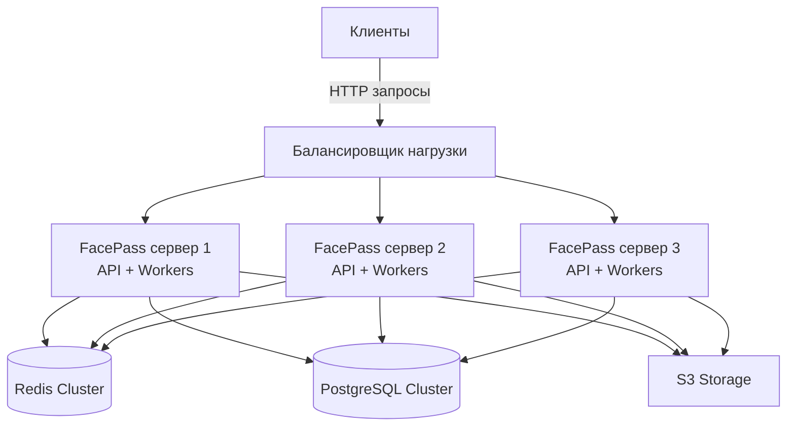
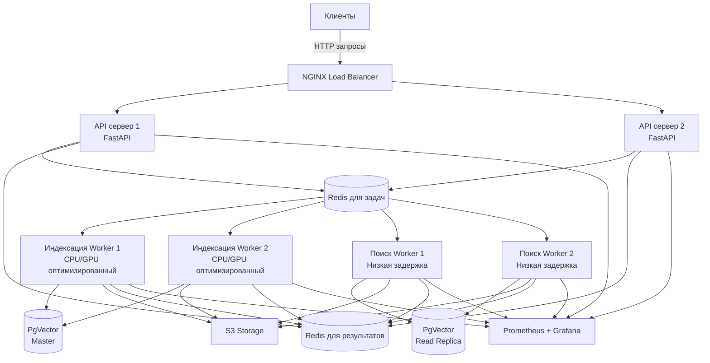

# Архитектура кластера серверов для FacePass

## Обзор архитектурных подходов

Для масштабирования системы FacePass существуют два основных подхода к организации кластера серверов:

1. **Горизонтально однородный кластер** - каждый сервер выполняет все функции
2. **Функционально специализированный кластер** - серверы разделены по функциям

## 1. Горизонтально однородный кластер

### Схема архитектуры



### Описание архитектуры

В этом подходе **каждый сервер в кластере запускает полный набор компонентов FacePass**:

1. **FastAPI сервер** - обрабатывает HTTP запросы
2. **Celery worker** - выполняет распознавание лиц
3. **Код для распознавания лиц** - InsightFace установлен на каждом сервере
4. **Мониторинг метрик** - локальные Prometheus экспортеры

### Как работает система

1. **Вход запросов**: Балансировщик нагрузки (NGINX, HAProxy) распределяет входящие HTTP запросы между серверами.
2. **Обработка API**: Каждый сервер самостоятельно обрабатывает полученные запросы.
3. **Фоновые задачи**: Если требуется индексация:
   - Сервер, принявший запрос, создает задачу в Redis
   - Локальные Celery workers на любом сервере могут взять задачу из Redis
   - Задача выполняется на том сервере, который ее взял
4. **Хранение данных**: Все серверы используют общие ресурсы:
   - Redis кластер для очередей задач
   - PostgreSQL кластер для хранения эмбеддингов
   - S3 хранилище для фотографий

### Пример реализации (docker-compose)

```yaml
version: '3'

services:
  facepass1:
    build: .
    environment:
      - INSTANCE_NAME=facepass1
      - REDIS_HOST=redis-cluster
      - DB_HOST=postgres-cluster
    deploy:
      resources:
        limits:
          cpus: '16'
          memory: 32G

  facepass2:
    build: .
    environment:
      - INSTANCE_NAME=facepass2
      - REDIS_HOST=redis-cluster
      - DB_HOST=postgres-cluster
    deploy:
      resources:
        limits:
          cpus: '16'
          memory: 32G

  facepass3:
    build: .
    environment:
      - INSTANCE_NAME=facepass3
      - REDIS_HOST=redis-cluster
      - DB_HOST=postgres-cluster
    deploy:
      resources:
        limits:
          cpus: '16'
          memory: 32G

  nginx-lb:
    image: nginx:latest
    ports:
      - "80:80"
    volumes:
      - ./nginx.conf:/etc/nginx/nginx.conf
    depends_on:
      - facepass1
      - facepass2
      - facepass3
```

### Преимущества

1. **Простота развертывания** - одинаковая конфигурация на всех серверах
2. **Равномерная нагрузка** - любой сервер может обработать любой запрос
3. **Отказоустойчивость** - отказ одного сервера не влияет на работу остальных
4. **Простота масштабирования** - просто добавляем новые идентичные серверы

### Недостатки

1. **Неэффективное использование ресурсов** - сложно оптимизировать для конкретных задач
2. **Дублирование моделей** - каждый сервер загружает модель InsightFace в память
3. **Отсутствие специализации** - нельзя выделить более мощное оборудование для индексации

## 2. Функционально специализированный кластер

### Схема архитектуры

```mermaid
graph TD
    Client[Клиенты] -->|HTTP запросы| LB[Балансировщик нагрузки]
    LB --> API1[API сервер 1<br/>FastAPI]
    LB --> API2[API сервер 2<br/>FastAPI]
    
    API1 --> Redis[(Redis Cluster)]
    API2 --> Redis
    
    Redis --> W1[Worker сервер 1<br/>"Индексация"]
    Redis --> W2[Worker сервер 2<br/>"Индексация"]
    Redis --> W3[Worker сервер 3<br/>"Поиск"]
    Redis --> W4[Worker сервер 4<br/>"Поиск"]
    
    W1 --> DB[(PostgreSQL Cluster)]
    W2 --> DB
    W3 --> DB
    W4 --> DB
    
    W1 --> S3[S3 Storage]
    W2 --> S3
    W3 --> S3
    W4 --> S3
```

### Описание архитектуры

В этом подходе серверы специализируются по функциям:

1. **API-серверы**: 
   - Принимают HTTP запросы
   - Валидируют входные данные
   - Создают задачи в Redis
   - Возвращают результаты клиентам
   - НЕ выполняют распознавание лиц

2. **Worker-серверы для индексации**:
   - Оптимизированы для CPU/GPU-интенсивных задач
   - Выполняют извлечение эмбеддингов из фотографий
   - Работают с большими пакетами данных
   - Имеют увеличенный объем RAM

3. **Worker-серверы для поиска**:
   - Оптимизированы для низкой задержки
   - Выполняют векторный поиск
   - Кэшируют популярные запросы
   - Быстро отвечают на пользовательские запросы

### Конкретный пример конфигурации

**API-сервер (оптимизирован для HTTP обработки):**
```
Оборудование: 
- CPU: 8-16 ядер
- RAM: 16-32 ГБ
- SSD: 100 ГБ
- Сеть: 10 Гбит/с

Программное обеспечение:
- FastAPI с async поддержкой
- Celery client (без workers)
- NGINX
- БЕЗ InsightFace моделей
```

**Worker-сервер для индексации (оптимизирован для вычислений):**
```
Оборудование: 
- CPU: 32-64 ядра или GPU: 4x NVIDIA T4
- RAM: 64-128 ГБ
- SSD: 500 ГБ
- Сеть: 10 Гбит/с

Программное обеспечение:
- Celery workers (8-16 для CPU или 4 для GPU)
- InsightFace с оптимизациями для batch-processing
- Параметр --concurrency оптимизирован для максимальной пропускной способности
```

**Worker-сервер для поиска (оптимизирован для быстрого отклика):**
```
Оборудование: 
- CPU: 16-32 ядра или GPU: 2x NVIDIA T4
- RAM: 128-256 ГБ (для кэширования)
- SSD NVMe: 1 ТБ
- Сеть: 10 Гбит/с

Программное обеспечение:
- Celery workers с настройками для низкой задержки
- InsightFace с оптимизациями для одиночных изображений
- Параметр --prefetch-multiplier=1 для немедленной обработки
- Системы кэширования результатов
```

### Как работает система

1. **Поступление запроса**: 
   - Клиент отправляет запрос к балансировщику нагрузки
   - Балансировщик направляет запрос к одному из API-серверов

2. **Обработка на API-сервере**:
   - API-сервер проверяет входные данные
   - Определяет тип задачи (индексация или поиск)
   - Создает соответствующую задачу в Redis с правильной очередью
   - Для синхронных запросов ожидает результат
   - Для асинхронных запросов сразу возвращает подтверждение

3. **Обработка Worker-серверами**:
   - Worker-серверы для индексации берут задачи из очереди индексации
   - Worker-серверы для поиска берут задачи из очереди поиска
   - Каждый worker выполняет распознавание лиц или поиск
   - Результаты сохраняются в БД или возвращаются через Redis

4. **Возврат результатов**:
   - API-сервер получает результаты из Redis или БД
   - Форматирует ответ и отправляет клиенту

### Преимущества

1. **Оптимизация ресурсов** - каждый сервер оптимизирован для своей задачи
2. **Повышенная производительность** - специализация позволяет достичь максимальной эффективности
3. **Гибкое масштабирование** - можно масштабировать каждый тип серверов независимо
4. **Приоритезация** - можно выделить больше ресурсов на критические операции
5. **Экономия** - более эффективное использование дорогостоящих ресурсов (GPU)

### Недостатки

1. **Сложность архитектуры** - требует более тщательного проектирования
2. **Сложность управления** - различные типы серверов требуют разной настройки
3. **Точки отказа** - выход из строя всех серверов одного типа приводит к недоступности определенных функций

## Рекомендуемый подход для FacePass

Для системы FacePass при планируемых нагрузках (18 точек, до 1.4 млн фото в день) **рекомендуется функционально специализированный кластер** по следующим причинам:

1. **Разные требования к ресурсам** - индексация требует много CPU/GPU, поиск требует быстрого доступа к данным
2. **Асимметричные нагрузки** - индексация может происходить пакетно, поиск требует немедленного ответа
3. **Эффективность ресурсов** - специализированные серверы позволяют оптимальнее использовать оборудование
4. **Возможность приоритезации** - можно обеспечить быстрый поиск даже во время массовой индексации

### Конкретная рекомендуемая архитектура



### Реализация код распознавания лиц

В специализированной архитектуре:

1. **API-серверы НЕ содержат код распознавания лиц**:
   - Экономия ОЗУ (модели InsightFace занимают ~1-2 ГБ)
   - Избегание ненужных вычислительных нагрузок
   - Фокус на быструю обработку HTTP-запросов

2. **Worker-серверы индексации содержат оптимизированный для батч-процессинга код**:
   ```python
   # В services/face_recognition.py на worker-серверах индексации
   def extract_batch_embeddings(self, batch_images: List[bytes]) -> List[Tuple[np.ndarray, float]]:
       """Оптимизированная для батчей функция извлечения эмбеддингов"""
       results = []
       # Пакетная обработка изображений
       batch_arrays = [self._bytes_to_image(img) for img in batch_images]
       # Групповое определение лиц
       for img in batch_arrays:
           faces = self.app.get(img)
           # ... обработка результатов
       return results
   ```

3. **Worker-серверы поиска содержат оптимизированный для быстрого отклика код**:
   ```python
   # В services/face_recognition.py на worker-серверах поиска
   def quick_extract_embedding(self, image_data: bytes) -> Tuple[np.ndarray, float]:
       """Оптимизированная для скорости функция извлечения одиночного эмбеддинга"""
       # Использование более легкой модели или параметров для быстрой обработки
       img = self._bytes_to_image(image_data)
       faces = self.app.get(img)
       # ... быстрая обработка результата
       return embedding, confidence
   ```

### Процесс развертывания

1. **Подготовка образов Docker** (пример):
   ```dockerfile
   # Базовый образ с общим кодом
   FROM python:3.12-slim AS base
   COPY requirements.txt .
   RUN pip install -r requirements.txt
   COPY . .
   
   # API-сервер (без InsightFace)
   FROM base AS api
   CMD ["uvicorn", "app.main:app", "--host", "0.0.0.0", "--port", "8000"]
   
   # Worker для индексации
   FROM base AS index-worker
   RUN pip install insightface onnxruntime-gpu
   CMD ["celery", "-A", "core.celery_app", "worker", "--queues=index", "--concurrency=8"]
   
   # Worker для поиска
   FROM base AS search-worker
   RUN pip install insightface onnxruntime-gpu
   CMD ["celery", "-A", "core.celery_app", "worker", "--queues=search", "--prefetch-multiplier=1"]
   ```

2. **Kubernetes конфигурация** для разделения очередей:
   ```yaml
   # В настройках Celery для разных типов worker-серверов
   # Для индексации
   CELERY_TASK_ROUTES = {
       'services.tasks.sync_s3_photos_task': {'queue': 'index'},
   }
   
   # Для поиска
   CELERY_TASK_ROUTES = {
       'services.tasks.search_face_task': {'queue': 'search'},
   }
   ```

## Заключение

Для FacePass оптимальной является **функционально специализированная кластерная архитектура** с разделением на API-серверы и специализированные worker-серверы. Такая архитектура позволит:

1. Оптимизировать использование ресурсов
2. Обеспечить высокую производительность индексации
3. Гарантировать низкую задержку для поисковых запросов
4. Масштабировать систему в зависимости от типа нагрузки

При этом код распознавания лиц будет размещаться только на worker-серверах, а API-серверы будут сфокусированы на обработке HTTP-запросов, что обеспечит наиболее эффективное использование ресурсов системы.