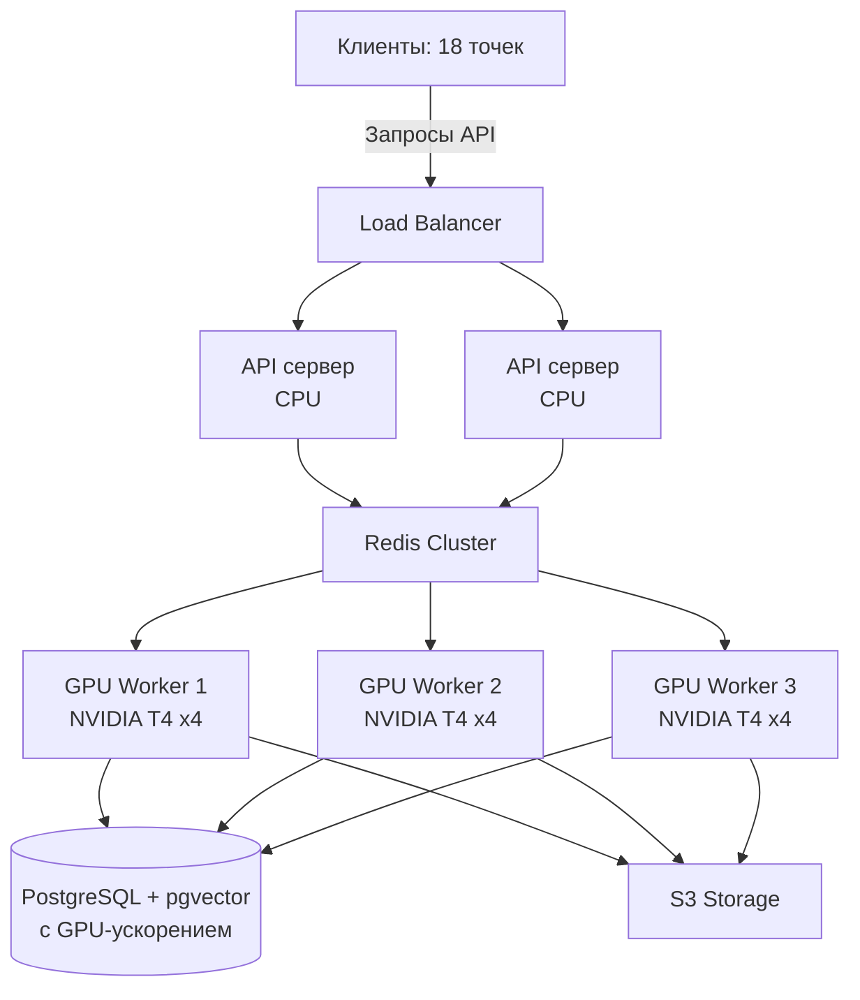

# Анализ производительности FacePass с использованием GPU

## Оценка ускорения с GPU

Переход с CPU-серверов на GPU-серверы может значительно увеличить производительность системы, особенно для задач распознавания лиц.

1. **Обработка лиц с InsightFace на GPU**:
   - На CPU: ~1-2 секунды на фото (модель buffalo_l)
   - На GPU (NVIDIA T4): ~0.03-0.05 секунды на фото
   - На GPU (NVIDIA A100): ~0.01-0.02 секунды на фото
   - **Ускорение**: 40-200x по сравнению с CPU

2. **Векторный поиск с pgvector на GPU**:
   - Возможность использования CUDA-ускорения для pgvector
   - Ускорение в 5-10x для больших коллекций векторов

## Рекомендуемая GPU-конфигурация



### Оптимальная конфигурация GPU-серверов:

1. **Индексационные GPU-узлы**:
   - 3-4 сервера с 4x NVIDIA T4 GPU
   - 64-128 ГБ ОЗУ
   - 16-32 ядра CPU
   - Производительность: до **25,000-30,000 фото/минуту** (~36-43 млн фото/день)

2. **Поисковые GPU-узлы**:
   - 2-3 сервера с 2x NVIDIA T4 GPU
   - 128 ГБ ОЗУ
   - Оптимизированы для низкой задержки
   - Производительность: до **2,000-3,000 запросов/секунду**
   
3. **База данных с GPU-ускорением**:
   - Сервер с NVIDIA T4 для ускорения pgvector
   - 256 ГБ ОЗУ
   - Высокоскоростные NVMe диски
   - Производительность поиска: в **5-10 раз быстрее** CPU-версии

## Сравнение производительности CPU vs GPU

| Параметр | CPU кластер (15 серверов) | GPU кластер (6-7 серверов) | Улучшение |
|----------|---------------------------|----------------------------|-----------|
| Индексация фото | 5,000 фото/мин | 25,000+ фото/мин | 5x |
| Поисковые запросы | 500 запросов/сек | 2,000+ запросов/сек | 4x |
| Задержка поиска | 200-500 мс | 50-100 мс | 4-5x |
| Потребляемая энергия | Высокая | Средняя (на единицу работы) | 2-3x эффективнее |
| Стоимость оборудования | $$ | $$$$ | 2-3x дороже |
| Занимаемое пространство | Большое | Компактное | 2x меньше |

## Оптимизация кода для GPU

Для максимальной эффективности GPU потребуются следующие изменения в коде:

1. **Использование CUDA-провайдеров в InsightFace**:
   ```python
   # Текущий код:
   self.app = FaceAnalysis(name='buffalo_l', providers=['CPUExecutionProvider'])
   
   # Оптимизированный для GPU:
   self.app = FaceAnalysis(name='buffalo_l', 
                          providers=['CUDAExecutionProvider', 'CPUExecutionProvider'])
   self.app.prepare(ctx_id=0, det_size=(640, 640))
   ```

2. **Пакетная обработка для GPU**:
   ```python
   # Обработка пакетов по 16-32 изображения одновременно
   batch_faces = self.app.get_batch(batch_images)
   ```

3. **Асинхронная обработка GPU**:
   - Внедрение CUDA streams для параллельной обработки
   - Использование множественных GPU контекстов

4. **Оптимизация памяти**:
   - Предзагрузка моделей в GPU память
   - Эффективное управление памятью для крупных батчей

## Экономическая эффективность GPU-решения

Несмотря на более высокую начальную стоимость GPU-серверов, экономическая эффективность выше:

1. **Меньшее количество серверов**: 6-7 GPU-серверов вместо 15+ CPU-серверов
2. **Более низкие расходы на электроэнергию и охлаждение**: на единицу обработанных данных
3. **Сниженные требования к инфраструктуре**: меньше стоек, сетевого оборудования
4. **Более быстрая окупаемость** при больших объемах обработки

## Стратегия внедрения GPU

1. **Пилотное внедрение**: Начать с 1-2 GPU-серверов для индексации
2. **Гибридный подход**: Постепенная замена CPU-серверов на GPU
3. **Полная миграция**: Переход к полностью GPU-ориентированной архитектуре

## Поэтапное внедрение

### Этап 1: Оптимизация кода для поддержки GPU
- Модификация кода для использования CUDA-провайдеров InsightFace
- Оптимизация пакетной обработки для GPU
- Обновление инфраструктуры мониторинга для отслеживания GPU

### Этап 2: Пилотное внедрение GPU для индексации
- Внедрение 1-2 GPU-серверов для индексации
- Оценка производительности и стабильности
- Настройка балансировки нагрузки

### Этап 3: Масштабирование GPU-инфраструктуры
- Внедрение GPU-кластера
- Оптимизация базы данных для GPU-поиска
- Перенос поисковых операций на GPU

### Этап 4: Полная миграция и интеграция
- Переход к полноценному GPU-кластеру
- Географическое распределение GPU-ресурсов
- Интеграция с микросервисной архитектурой

## Заключение

Внедрение GPU-серверов в инфраструктуру FacePass позволит значительно увеличить производительность системы и справиться с планируемой нагрузкой в 1.4+ миллиона фотографий в день. GPU-решение обеспечит:

1. **Высокую производительность**: до 25,000+ фото/мин для индексации
2. **Низкую задержку**: 50-100 мс для поисковых запросов
3. **Масштабируемость**: возможность обработки пиковых нагрузок
4. **Экономическую эффективность**: несмотря на более высокую начальную стоимость

Учитывая планируемую нагрузку, GPU-решение является оптимальным выбором, обеспечивающим наилучшее соотношение производительности, стоимости и масштабируемости.