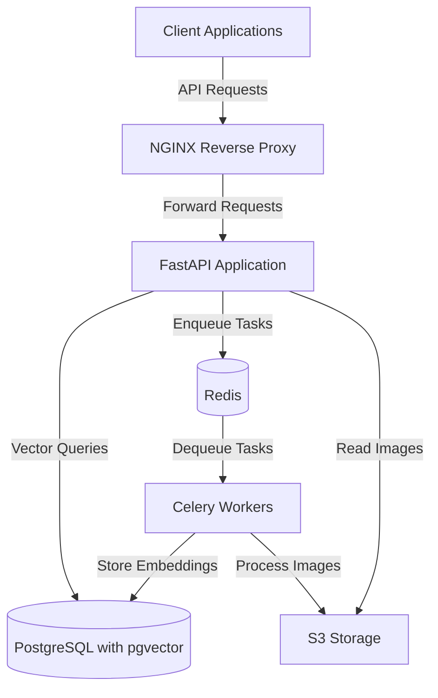
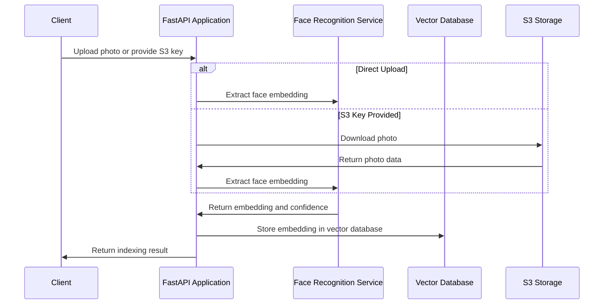
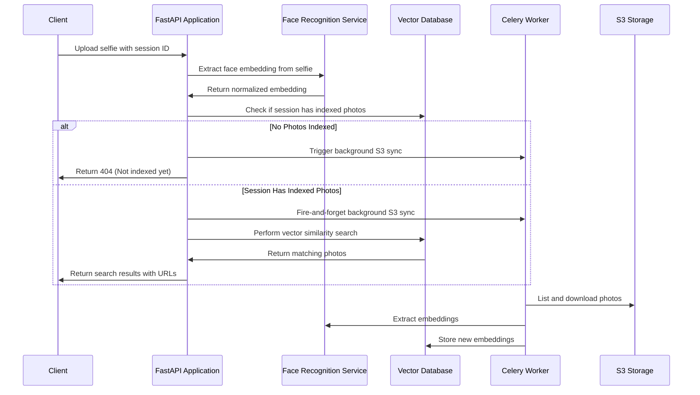

# FacePass - Master Design Document

## Table of Contents

1. [DevOps Architecture](#devops-architecture)
   - [Technology Stack](#technology-stack)
   - [Environment Configuration](#environment-configuration)
   - [Process Management](#process-management)
   - [Component Interaction](#component-interaction)

2. [System Analytics](#system-analytics)
   - [API Endpoints](#api-endpoints)
   - [Data Flow](#data-flow)
   - [Background Tasks](#background-tasks)

3. [Business Logic](#business-logic)
   - [Lazy Indexing Mechanism](#lazy-indexing-mechanism)
   - [Face Recognition Workflow](#face-recognition-workflow)
   - [S3 Integration](#s3-integration)

4. [Code Map](#code-map)
   - [Core Modules](#core-modules)
   - [Application Modules](#application-modules)
   - [Services](#services)
   - [Models](#models)
   - [Utils and Middleware](#utils-and-middleware)

## DevOps Architecture

### Technology Stack

FacePass is built on a robust technology stack designed for high performance in face recognition tasks:

- **Python 3.12**: Core programming language with modern features
- **FastAPI**: High-performance web framework for building APIs
- **Celery**: Distributed task queue for handling background processing
- **Redis**: Message broker and result backend for Celery
- **PostgreSQL with pgvector**: Vector database for storing face embeddings
- **InsightFace (buffalo_l model)**: Deep learning model for face recognition
- **S3-compatible storage**: Used for storing photos
- **PM2**: Process manager for running and monitoring application processes
- **NGINX**: Web server configured as a reverse proxy

### Environment Configuration

The system uses a centralized configuration approach based on environment variables loaded from `.env` files:

| Category | Key Variables | Description |
|----------|---------------|-------------|
| Application | `APP_NAME`, `APP_VERSION`, `DEBUG` | Basic application settings |
| PostgreSQL | `POSTGRES_USER`, `POSTGRES_PASSWORD`, `POSTGRES_DB`, `POSTGRES_HOST` | Database connection parameters |
| Redis | `REDIS_HOST`, `REDIS_PORT`, `REDIS_DB`, `REDIS_PASSWORD` | Redis connection settings |
| Celery | `CELERY_BROKER_URL`, `CELERY_RESULT_BACKEND` | Optional Celery-specific URLs (defaults to Redis) |
| S3 Storage | `S3_ENDPOINT`, `S3_ACCESS_KEY`, `S3_SECRET_KEY`, `S3_BUCKET`, `S3_ENV_PREFIX` | S3 connection and environment settings |
| API | `API_KEYS`, `CORS_ORIGINS` | Security and access control |
| Face Recognition | `FACE_DETECTION_THRESHOLD`, `FACE_SIMILARITY_THRESHOLD`, `EMBEDDING_DIMENSION` | Recognition algorithm parameters |

The system uses a standardized approach for constructing connection URLs from base parameters, with settings loaded once and cached using `@lru_cache` for performance.

### Process Management

The application is designed to run as a set of coordinated processes:

1. **FastAPI Web Server**: Handles HTTP requests and serves the API
2. **Celery Worker(s)**: Process background tasks like image indexing
3. **Redis Server**: Serves as message broker and backend for Celery

The Celery workers are configured with the following settings:
- Worker concurrency is set to half the available CPU cores (capped at 4) to ensure resources are available for real-time face search requests
- Task results are ignored since the system only cares about side effects (DB writes)
- JSON serialization for tasks and results
- UTC timezone for consistent time handling
- Automatic broker connection retry on startup

### Component Interaction

The system components interact as follows:



## System Analytics

### API Endpoints

The FacePass API provides the following endpoints:

| Endpoint | Method | Description | Auth Required | Rate Limited |
|----------|--------|-------------|--------------|--------------|
| `/api/v2/index` | POST | Index a single photo by extracting face embedding | Yes (API Key) | Yes |
| `/api/v2/index/batch` | POST | Index multiple photos at once for better performance | Yes (API Key) | Yes |
| `/api/v2/index/{session_id}` | DELETE | Delete all face embeddings for a specific session | Yes (API Key) | Yes |
| `/api/v2/search/status/{session_id}` | GET | Check if a session has indexed photos and get statistics | No | No |
| `/api/v2/search` | POST | Search for similar faces in a session by uploading a selfie | No | Yes |
| `/api/v2/health` | GET | Health check endpoint for monitoring | No | No |
| `/api/v2/metrics` | GET | Prometheus metrics endpoint for monitoring | No | No |

#### Endpoint Details

**POST /api/v2/index**
- Accepts either a direct file upload or an S3 key for an already uploaded photo
- Extracts face embedding using InsightFace
- Stores embedding in vector database
- Idempotent operation - updates existing embedding if photo already indexed

**POST /api/v2/index/batch**
- Optimized for indexing many photos at once
- Processes all photos and returns a summary of successes and failures
- Idempotent operation - updates existing embeddings

**DELETE /api/v2/index/{session_id}**
- Removes all indexed photos for a session from the database
- Used when a session is deleted or needs to be re-indexed

**GET /api/v2/search/status/{session_id}**
- Returns information about indexed photos for a session
- Includes whether any photos are indexed, count, and timestamp of last indexing

**POST /api/v2/search**
- Allows clients to find photos by uploading a selfie
- Extracts face embedding from selfie
- Searches for similar faces in the specified session
- Returns matches with similarity scores
- Triggers asynchronous background indexing if needed (Lazy Indexing)

**GET /api/v2/health**
- Checks database connectivity, face recognition model status, and service uptime
- Used by monitoring systems and load balancers

**GET /api/v2/metrics**
- Exposes Prometheus metrics for monitoring
- Includes counters for requests, durations, and database statistics

### Data Flow

The system operates with the following data flow patterns:

#### Photo Indexing Flow



#### Face Search Flow



### Background Tasks

The system uses Celery to handle background processing tasks:

**sync_s3_photos_task**:
- Triggered:
  1. Automatically when a search request is made (both when photos exist and when they don't)
  2. Can be triggered manually via API
- Process:
  1. Lists photos in S3 for the given session ID
  2. Downloads photos that haven't been indexed yet
  3. Extracts face embeddings 
  4. Stores embeddings in the vector database
  5. Reports statistics on indexed and failed photos

The background task system is designed for reliability:
- Each task runs in its own DB session that is properly closed
- Comprehensive error handling and logging
- Idempotent operations allow safe retries

## Business Logic

### Lazy Indexing Mechanism

The system implements a "Lazy Indexing" approach that balances real-time responsiveness with eventual consistency:

1. **On-Demand Indexing**: Rather than pre-indexing all photos, the system indexes photos as they're needed
   
2. **Search-Time Trigger**: When a search request arrives:
   - System checks if the session has any indexed photos
   - If no photos are indexed:
     - Triggers background S3 sync task
     - Returns 404 to client, indicating photos need to be indexed
     - Client can poll status endpoint and retry search when indexing completes
   - If photos are already indexed:
     - Performs search against current database state
     - ALSO triggers background S3 sync to index any new photos
     - Returns results immediately from what's already indexed

3. **Background Processing**: The actual indexing happens asynchronously:
   - Doesn't block the search request
   - Only indexes new photos not already in the database
   - Updates happen continuously without client intervention

4. **Advantages**:
   - Fast response time (~200ms) for search regardless of S3 latency
   - New photos become searchable automatically without explicit indexing requests
   - System automatically stays in sync with S3 storage
   - Efficient resource usage - only processes what's needed

This mechanism is implemented in the `/search` endpoint at lines 475-503 in `app/api/v1/endpoints/indexing.py`.

### Face Recognition Workflow

The face recognition process involves several steps:

1. **Face Detection**: Using the InsightFace buffalo_l model to detect faces in images
   
2. **Embedding Extraction**: Converting each face into a 512-dimensional vector (embedding)
   
3. **Embedding Normalization**: Ensuring consistent vector lengths for reliable similarity matching
   
4. **Vector Storage**: Storing embeddings in a PostgreSQL database with pgvector extension
   
5. **Similarity Search**: Using cosine similarity to find matching faces above a configurable threshold

The system is optimized for both performance and accuracy:
- Uses a high-quality deep learning model (buffalo_l)
- Handles various face orientations, lighting conditions, and image qualities
- Configurable thresholds for detection confidence and match similarity
- Efficient vector operations through pgvector extension

### S3 Integration

The system integrates with S3-compatible storage for photo management:

1. **Storage Structure**:
   ```
   {env_prefix}/photos/{session_id}/originals/ - Original uploaded photos
   {env_prefix}/photos/{session_id}/previews/ - Preview versions for display
   ```
   
2. **Environment Prefixes**:
   - Supports multiple environments (staging/production) using prefixes
   - Configurable via `S3_ENV_PREFIX` setting or per-request parameters
   
3. **Dynamic Path Handling**:
   - Robust path construction logic for different prefix scenarios
   - Handles various client-provided path formats for compatibility

4. **Operations**:
   - Listing objects within a session
   - Downloading images
   - Constructing image URLs for client display

## Code Map

### Core Modules

**`core/config.py`**
- Centralized configuration management
- Environment variable loading with validation
- Connection URL construction
- Type-safe configuration with Pydantic

**`core/celery_app.py`**
- Celery application configuration
- Task queue setup with Redis
- Worker concurrency settings
- Performance tuning

**`core/database.py`**
- PostgreSQL + pgvector connection setup
- SQLAlchemy session management
- Base model definition for ORM

**`core/s3.py`**
- S3 client configuration
- Photo download and listing functions
- Error handling for S3 operations

### Application Modules

**`app/main.py`**
- FastAPI application initialization
- Middleware setup (CORS, logging, security)
- Startup events and API router inclusion
- Database table creation

**`app/api/v1/router.py`**
- API route registration
- Endpoint grouping and tagging

**`app/api/v1/endpoints/indexing.py`**
- API endpoint implementation for all face operations
- Photo indexing, search, and management
- Health and metrics endpoints
- Lazy indexing logic

**`app/api/deps.py`**
- Dependency injection for FastAPI
- Database session management in request context

**`app/middleware/auth.py`**
- API key authentication
- Security enforcement for protected endpoints

**`app/middleware/rate_limit.py`**
- Request rate limiting
- Configurable limits for different endpoint types

**`app/schemas/indexing.py`**
- Pydantic models for request/response validation
- Data structure definitions for API

**`app/utils/validation.py`**
- Input validation for API parameters
- Image upload validation

### Services

**`services/face_recognition.py`**
- Face detection and embedding extraction
- InsightFace model integration
- Image processing utilities
- Embedding comparison functions

**`services/indexing.py`**
- Photo indexing workflows
- Database operations for embeddings
- S3 synchronization logic
- Session management

**`services/tasks.py`**
- Celery task definitions for background processing
- Database session handling for tasks
- Error handling and logging

**`services/photo_indexing.py`**
- High-level photo processing workflows
- Integration between S3, face recognition, and database

### Models

**`models/face.py`**
- Database model for face embeddings
- pgvector integration for vector storage
- Table schemas and relationships
- Helper methods for embedding manipulation

### Utils and Middleware

The system includes various utility modules for cross-cutting concerns:

- **Logging**: Structured logging with context and formatting
- **Security**: Content Security Policy, permission policies, XSS protection
- **Monitoring**: Prometheus metrics integration
- **Authentication**: API key validation
- **Rate Limiting**: Configurable request throttling