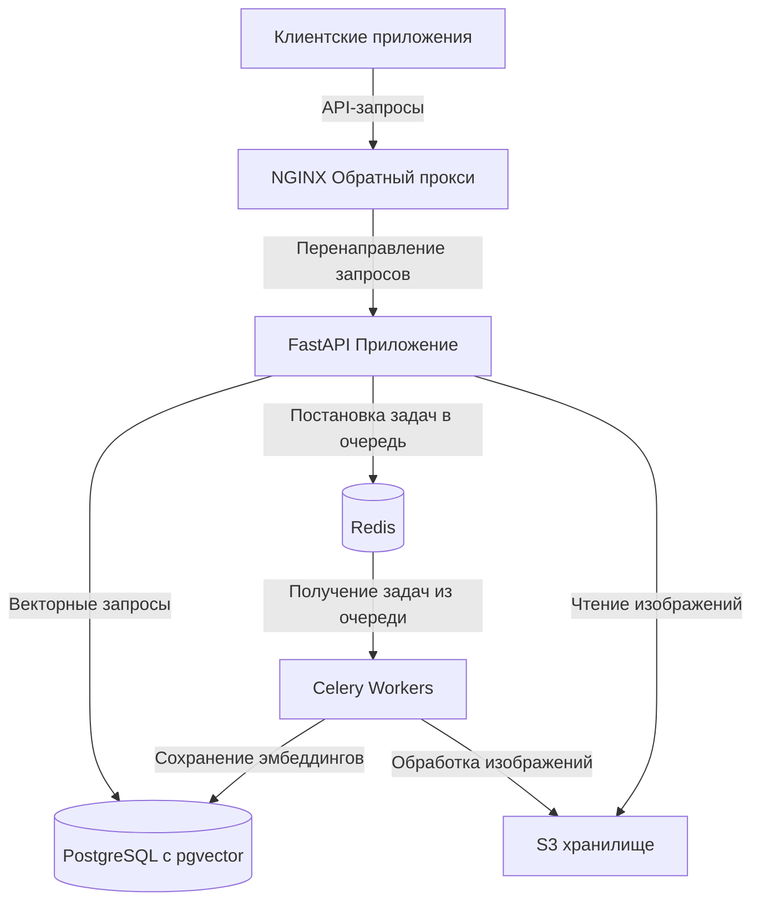
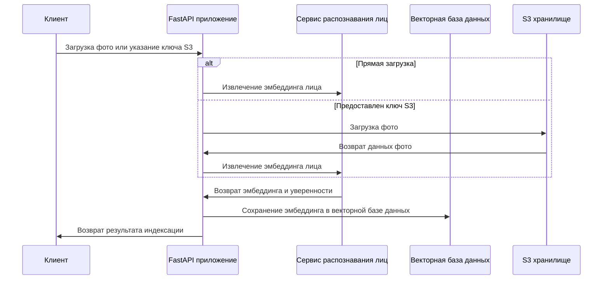
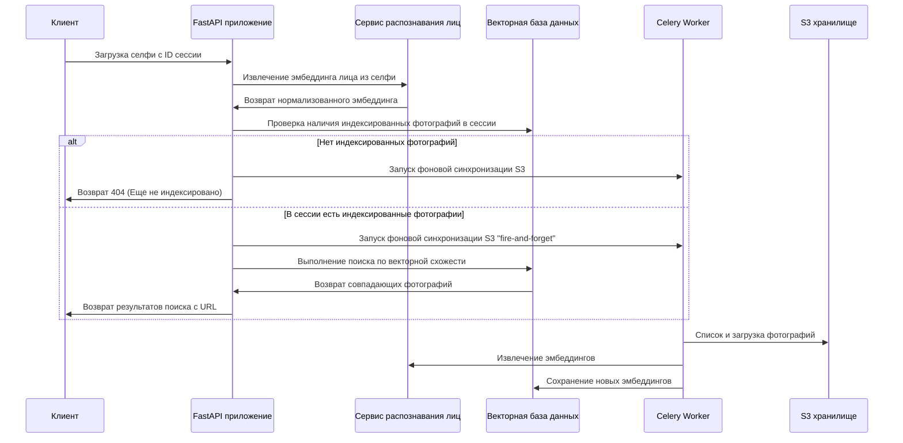

# FacePass - Основной Документ по Архитектуре

## Содержание

1. [Архитектура DevOps](#архитектура-devops)
   - [Технологический стек](#технологический-стек)
   - [Конфигурация окружения](#конфигурация-окружения)
   - [Управление процессами](#управление-процессами)
   - [Взаимодействие компонентов](#взаимодействие-компонентов)

2. [Системная аналитика](#системная-аналитика)
   - [API-эндпоинты](#api-эндпоинты)
   - [Потоки данных](#потоки-данных)
   - [Фоновые задачи](#фоновые-задачи)

3. [Бизнес-логика](#бизнес-логика)
   - [Механизм ленивой индексации](#механизм-ленивой-индексации)
   - [Процесс распознавания лиц](#процесс-распознавания-лиц)
   - [Интеграция с S3](#интеграция-с-s3)

4. [Карта кода](#карта-кода)
   - [Основные модули](#основные-модули)
   - [Модули приложения](#модули-приложения)
   - [Сервисы](#сервисы)
   - [Модели](#модели)
   - [Утилиты и промежуточное ПО](#утилиты-и-промежуточное-по)

## Архитектура DevOps

### Технологический стек

FacePass построен на надежном технологическом стеке, разработанном для высокой производительности в задачах распознавания лиц:

- **Python 3.12**: Основной язык программирования с современными функциями
- **FastAPI**: Высокопроизводительный веб-фреймворк для создания API
- **Celery**: Распределенная очередь задач для обработки фоновых процессов
- **Redis**: Брокер сообщений и бэкенд результатов для Celery
- **PostgreSQL с pgvector**: Векторная база данных для хранения эмбеддингов лиц
- **InsightFace (модель buffalo_l)**: Модель глубокого обучения для распознавания лиц
- **S3-совместимое хранилище**: Используется для хранения фотографий
- **PM2**: Менеджер процессов для запуска и мониторинга процессов приложения
- **NGINX**: Веб-сервер, настроенный как обратный прокси

### Конфигурация окружения

Система использует централизованный подход к конфигурации на основе переменных окружения, загружаемых из файлов `.env`:

| Категория | Ключевые переменные | Описание |
|----------|---------------|-------------|
| Приложение | `APP_NAME`, `APP_VERSION`, `DEBUG` | Базовые настройки приложения |
| PostgreSQL | `POSTGRES_USER`, `POSTGRES_PASSWORD`, `POSTGRES_DB`, `POSTGRES_HOST` | Параметры подключения к базе данных |
| Redis | `REDIS_HOST`, `REDIS_PORT`, `REDIS_DB`, `REDIS_PASSWORD` | Настройки подключения к Redis |
| Celery | `CELERY_BROKER_URL`, `CELERY_RESULT_BACKEND` | Опциональные URL для Celery (по умолчанию используется Redis) |
| S3 хранилище | `S3_ENDPOINT`, `S3_ACCESS_KEY`, `S3_SECRET_KEY`, `S3_BUCKET`, `S3_ENV_PREFIX` | Настройки подключения к S3 и параметры окружения |
| API | `API_KEYS`, `CORS_ORIGINS` | Безопасность и контроль доступа |
| Распознавание лиц | `FACE_DETECTION_THRESHOLD`, `FACE_SIMILARITY_THRESHOLD`, `EMBEDDING_DIMENSION` | Параметры алгоритма распознавания |

Система использует стандартизированный подход для построения URL-соединений из базовых параметров, при этом настройки загружаются один раз и кэшируются с помощью `@lru_cache` для повышения производительности.

### Управление процессами

Приложение разработано для работы в виде набора скоординированных процессов:

1. **FastAPI веб-сервер**: Обрабатывает HTTP-запросы и обслуживает API
2. **Celery Worker(ы)**: Обрабатывает фоновые задачи, такие как индексация изображений
3. **Redis Server**: Служит брокером сообщений и бэкендом для Celery

Рабочие процессы Celery настроены со следующими параметрами:
- Параллелизм рабочих процессов установлен на половину доступных ядер CPU (максимум 4) для обеспечения доступности ресурсов для запросов поиска лиц в реальном времени
- Результаты задач игнорируются, поскольку система заботится только о побочных эффектах (записи в БД)
- JSON-сериализация для задач и результатов
- Часовой пояс UTC для согласованной обработки времени
- Автоматический повтор подключения к брокеру при запуске

### Взаимодействие компонентов

Компоненты системы взаимодействуют следующим образом:



## Системная аналитика

### API-эндпоинты

API FacePass предоставляет следующие эндпоинты:

| Эндпоинт | Метод | Описание | Требуется авторизация | Лимитирован |
|----------|--------|-------------|--------------|--------------|
| `/api/v2/index` | POST | Индексация одной фотографии путем извлечения эмбеддинга лица | Да (API Key) | Да |
| `/api/v2/index/batch` | POST | Индексация нескольких фотографий одновременно для лучшей производительности | Да (API Key) | Да |
| `/api/v2/index/{session_id}` | DELETE | Удаление всех эмбеддингов лиц для определенной сессии | Да (API Key) | Да |
| `/api/v2/search/status/{session_id}` | GET | Проверка, имеет ли сессия индексированные фотографии и получение статистики | Нет | Нет |
| `/api/v2/search` | POST | Поиск похожих лиц в сессии путем загрузки селфи | Нет | Да |
| `/api/v2/health` | GET | Эндпоинт проверки работоспособности для мониторинга | Нет | Нет |
| `/api/v2/metrics` | GET | Эндпоинт метрик Prometheus для мониторинга | Нет | Нет |

#### Подробная информация об эндпоинтах

**POST /api/v2/index**
- Принимает либо прямую загрузку файла, либо ключ S3 для уже загруженной фотографии
- Извлекает эмбеддинг лица с помощью InsightFace
- Сохраняет эмбеддинг в векторной базе данных
- Идемпотентная операция - обновляет существующий эмбеддинг, если фото уже индексировано

**POST /api/v2/index/batch**
- Оптимизирован для индексации многих фотографий одновременно
- Обрабатывает все фотографии и возвращает сводку успехов и неудач
- Идемпотентная операция - обновляет существующие эмбеддинги

**DELETE /api/v2/index/{session_id}**
- Удаляет все индексированные фотографии для сессии из базы данных
- Используется, когда сессия удаляется или требуется переиндексация

**GET /api/v2/search/status/{session_id}**
- Возвращает информацию об индексированных фотографиях для сессии
- Включает информацию о том, есть ли индексированные фотографии, их количество и временную метку последней индексации

**POST /api/v2/search**
- Позволяет клиентам находить фотографии путем загрузки селфи
- Извлекает эмбеддинг лица из селфи
- Ищет похожие лица в указанной сессии
- Возвращает совпадения с оценками схожести
- При необходимости запускает асинхронную фоновую индексацию (Ленивая Индексация)

**GET /api/v2/health**
- Проверяет подключение к базе данных, статус модели распознавания лиц и время работы сервиса
- Используется системами мониторинга и балансировщиками нагрузки

**GET /api/v2/metrics**
- Предоставляет метрики Prometheus для мониторинга
- Включает счетчики запросов, продолжительность и статистику базы данных

### Потоки данных

Система работает со следующими схемами потоков данных:

#### Поток индексации фотографий



#### Поток поиска лиц



### Фоновые задачи

Система использует Celery для обработки фоновых задач:

**sync_s3_photos_task**:
- Запускается:
  1. Автоматически при выполнении поискового запроса (как при наличии фотографий, так и при их отсутствии)
  2. Может быть запущена вручную через API
- Процесс:
  1. Получает список фотографий в S3 для данного ID сессии
  2. Загружает фотографии, которые еще не были индексированы
  3. Извлекает эмбеддинги лиц
  4. Сохраняет эмбеддинги в векторной базе данных
  5. Сообщает статистику по индексированным и неудавшимся фотографиям

Система фоновых задач спроектирована для надежности:
- Каждая задача выполняется в собственной сессии БД, которая правильно закрывается
- Комплексная обработка ошибок и логирование
- Идемпотентные операции позволяют безопасно повторять задачи

## Бизнес-логика

### Механизм ленивой индексации

Система реализует подход "Ленивой Индексации" (Lazy Indexing), который балансирует отзывчивость в реальном времени с итоговой согласованностью:

1. **Индексация по запросу**: Вместо предварительной индексации всех фотографий система индексирует фотографии по мере необходимости
   
2. **Триггер во время поиска**: Когда поступает запрос на поиск:
   - Система проверяет, есть ли у сессии какие-либо индексированные фотографии
   - Если фотографии не индексированы:
     - Запускает фоновую задачу синхронизации S3
     - Возвращает клиенту 404, указывая, что фотографии нужно индексировать
     - Клиент может опрашивать эндпоинт статуса и повторно искать, когда индексация завершится
   - Если фотографии уже индексированы:
     - Выполняет поиск по текущему состоянию базы данных
     - ТАКЖЕ запускает фоновую синхронизацию S3 для индексации новых фотографий
     - Немедленно возвращает результаты из уже индексированных фотографий

3. **Фоновая обработка**: Реальная индексация происходит асинхронно:
   - Не блокирует поисковый запрос
   - Индексирует только новые фотографии, которых еще нет в базе данных
   - Обновления происходят постоянно без вмешательства клиента

4. **Преимущества**:
   - Быстрое время отклика (~200мс) для поиска независимо от задержки S3
   - Новые фотографии становятся доступными для поиска автоматически без явных запросов на индексацию
   - Система автоматически синхронизируется с хранилищем S3
   - Эффективное использование ресурсов - обрабатывается только то, что необходимо

Этот механизм реализован в эндпоинте `/search` на строках 475-503 в `app/api/v1/endpoints/indexing.py`.

### Процесс распознавания лиц

Процесс распознавания лиц включает несколько этапов:

1. **Обнаружение лиц**: Использование модели InsightFace buffalo_l для обнаружения лиц на изображениях
   
2. **Извлечение эмбеддинга**: Преобразование каждого лица в 512-мерный вектор (эмбеддинг)
   
3. **Нормализация эмбеддинга**: Обеспечение согласованной длины векторов для надежного сопоставления схожести
   
4. **Векторное хранение**: Хранение эмбеддингов в базе данных PostgreSQL с расширением pgvector
   
5. **Поиск схожести**: Использование косинусного сходства для поиска совпадающих лиц выше настраиваемого порога

Система оптимизирована как для производительности, так и для точности:
- Использует высококачественную модель глубокого обучения (buffalo_l)
- Обрабатывает различные ориентации лиц, условия освещения и качество изображений
- Настраиваемые пороги для уверенности обнаружения и схожести совпадений
- Эффективные векторные операции через расширение pgvector

### Интеграция с S3

Система интегрируется с S3-совместимым хранилищем для управления фотографиями:

1. **Структура хранения**:
   ```
   {env_prefix}/photos/{session_id}/originals/ - Оригинальные загруженные фотографии
   {env_prefix}/photos/{session_id}/previews/ - Версии предпросмотра для отображения
   ```
   
2. **Префиксы окружения**:
   - Поддерживает несколько окружений (staging/production) с использованием префиксов
   - Настраивается через параметр `S3_ENV_PREFIX` или параметры запроса
   
3. **Обработка динамических путей**:
   - Надежная логика построения путей для различных сценариев с префиксами
   - Обрабатывает различные форматы путей, предоставляемые клиентом, для совместимости

4. **Операции**:
   - Перечисление объектов в пределах сессии
   - Загрузка изображений
   - Построение URL изображений для отображения клиентом

## Карта кода

### Основные модули

**`core/config.py`**
- Централизованное управление конфигурацией
- Загрузка переменных окружения с валидацией
- Построение URL соединений
- Типобезопасная конфигурация с использованием Pydantic

**`core/celery_app.py`**
- Конфигурация приложения Celery
- Настройка очереди задач с Redis
- Настройки параллелизма рабочих процессов
- Настройка производительности

**`core/database.py`**
- Настройка подключения к PostgreSQL + pgvector
- Управление сессиями SQLAlchemy
- Определение базовой модели для ORM

**`core/s3.py`**
- Конфигурация клиента S3
- Функции загрузки и перечисления фотографий
- Обработка ошибок для операций S3

### Модули приложения

**`app/main.py`**
- Инициализация приложения FastAPI
- Настройка промежуточного ПО (CORS, логирование, безопасность)
- События запуска и включение маршрутизатора API
- Создание таблиц базы данных

**`app/api/v1/router.py`**
- Регистрация маршрутов API
- Группировка и тэгирование эндпоинтов

**`app/api/v1/endpoints/indexing.py`**
- Реализация API эндпоинтов для всех операций с лицами
- Индексация фотографий, поиск и управление
- Эндпоинты проверки работоспособности и метрик
- Логика ленивой индексации

**`app/api/deps.py`**
- Внедрение зависимостей для FastAPI
- Управление сессией базы данных в контексте запроса

**`app/middleware/auth.py`**
- Аутентификация по API-ключу
- Обеспечение безопасности для защищенных эндпоинтов

**`app/middleware/rate_limit.py`**
- Ограничение скорости запросов
- Настраиваемые лимиты для разных типов эндпоинтов

**`app/schemas/indexing.py`**
- Модели Pydantic для валидации запросов/ответов
- Определения структур данных для API

**`app/utils/validation.py`**
- Валидация входных параметров для API
- Валидация загрузки изображений

### Сервисы

**`services/face_recognition.py`**
- Обнаружение лиц и извлечение эмбеддингов
- Интеграция с моделью InsightFace
- Утилиты для обработки изображений
- Функции сравнения эмбеддингов

**`services/indexing.py`**
- Процессы индексации фотографий
- Операции с базой данных для эмбеддингов
- Логика синхронизации S3
- Управление сессиями

**`services/tasks.py`**
- Определения задач Celery для фоновой обработки
- Обработка сессий базы данных для задач
- Обработка ошибок и логирование

**`services/photo_indexing.py`**
- Высокоуровневые рабочие процессы обработки фотографий
- Интеграция между S3, распознаванием лиц и базой данных

### Модели

**`models/face.py`**
- Модель базы данных для эмбеддингов лиц
- Интеграция pgvector для хранения векторов
- Схемы таблиц и отношения
- Вспомогательные методы для манипулирования эмбеддингами

### Утилиты и промежуточное ПО

Система включает различные утилитарные модули для сквозных задач:

- **Логирование**: Структурированное логирование с контекстом и форматированием
- **Безопасность**: Политика безопасности контента, политики разрешений, защита от XSS
- **Мониторинг**: Интеграция метрик Prometheus
- **Аутентификация**: Проверка API-ключей
- **Ограничение скорости**: Настраиваемое ограничение запросов