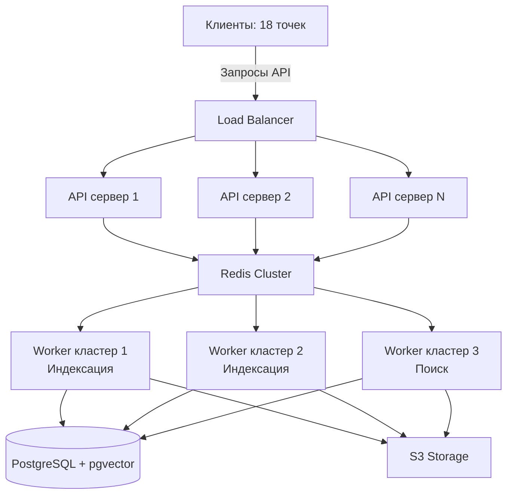

# Анализ производительности FacePass и рекомендации по масштабированию

## Текущая производительность

Исходя из анализа кода и архитектуры FacePass, можно выделить следующие аспекты текущей производительности:

### Текущие характеристики
- **Нагрузка**: До 3000 фотографий за мероприятие
- **Параллелизм**: Одно мероприятие одновременно
- **Оборудование**: Сервер с 16 ядрами CPU и 32 ГБ ОЗУ
- **Обработка**: Celery workers с ограниченным параллелизмом (половина ядер CPU, максимум 8)

### Оценка текущей производительности

Текущая система на сервере с 16 ядрами способна эффективно обрабатывать нагрузки в пределах:

#### Базовые метрики
- **Индексация одного фото**: ~0.7-1.5 секунд на фото (зависит от размера и сложности изображения)
- **Индексация в пакетном режиме**: ~50-100 фотографий в минуту при использовании 8 воркеров
- **Поиск**: ~20-30 запросов в секунду при типичных объемах данных (3000 фотографий)
- **Общая пропускная способность**: ~5,000-10,000 фотографий в день при непрерывной обработке

#### Пример расчета для стандартного сценария
**Сценарий 1**: Одно мероприятие, 3000 фотографий
- Время индексации = 3000 фотографий ÷ 75 фото/мин = ~40 минут
- Нагрузка на CPU: ~50% (8 из 16 ядер)
- Нагрузка на память: ~30-40% (9-13 ГБ из 32 ГБ)

Для текущих нагрузок (3000 фотографий за мероприятие) система справляется эффективно. Время индексации составляет примерно 30-60 минут, что приемлемо для текущего сценария использования.

#### Сценарий с параллельными мероприятиями
**Сценарий 2**: Три параллельных мероприятия по 5000 фото каждое

1. **Общая нагрузка**: 15,000 фотографий
2. **Конкуренция за ресурсы**:
   - Celery workers будут обрабатывать задачи из трех сессий конкурентно
   - При параллельной загрузке фото со всех мероприятий все задачи попадают в одну очередь

3. **Производительность индексации**:
   - При идеальной скорости 75 фото/мин: 15,000 ÷ 75 = **~200 минут (~3.3 часа)** для полной индексации
   - При параллельной загрузке создается дополнительная нагрузка на сеть и I/O:
     ```
     Скорость загрузки = 3 мероприятия × 20 фото/мин = ~60 фото/мин
     ```
   - На практике фактическое время может увеличиться на 20-30% из-за конкуренции за ресурсы:
     ```
     Фактическое время индексации ≈ 200 × 1.25 = **~250 минут (~4.2 часа)**
     ```

4. **Использование ресурсов**:
   - CPU: стабильная нагрузка 90-100% на все доступные ядра
   - Память: пиковое использование до 80-85% (25-27 ГБ)
   - Redis: высокая нагрузка, очередь может достигать 10,000+ задач
   - Диск I/O: повышенная активность из-за параллельного доступа к базе данных

5. **Проблемы, которые могут возникнуть**:
   - Насыщение очереди Redis, что может привести к замедлению работы
   - Возможное исчерпание памяти при пиковых нагрузках
   - Конкуренция за I/O операции, что замедлит работу базы данных
   - Задержка ответов API из-за высокой загрузки CPU

**Вывод по сценарию 2**: Текущая система сможет обработать 3 параллельных мероприятия по 5000 фотографий, но с существенным снижением производительности и повышенным риском отказов. Время полной индексации составит около 4-5 часов, что может не соответствовать ожиданиям пользователей. На время обработки также будут существенно замедлены поисковые запросы.

## Анализ планируемой нагрузки

### Требуемые объемы
- **На одну точку**: 20,000-80,000 фотографий в день
- **Количество точек**: 18 одновременно
- **Максимальная нагрузка**: до 1,440,000 фотографий в день (80,000 × 18)
- **Средняя нагрузка в час**: ~60,000 фотографий (~1,440,000 / 24)
- **Пиковая нагрузка в час**: потенциально в 3-5 раз выше средней (~180,000-300,000 фото/час)

### Узкие места текущей архитектуры

1. **CPU для обработки лиц**:
   - Извлечение эмбеддингов лиц требует значительных CPU-ресурсов
   - Модель buffalo_l занимает ~1-2 секунды на фото (в зависимости от оборудования)
   - Ограничение в 8 воркеров позволяет обработать максимум ~240-480 фото в минуту

2. **Потенциальное насыщение базы данных**:
   - pgvector хорошо работает до ~1 миллиона векторов на одном экземпляре
   - Поиск становится значительно медленнее при больших объемах данных

3. **Ограничения Redis**:
   - Текущая конфигурация использует одиночный экземпляр Redis
   - При большом количестве задач в очереди и пиковой нагрузке возможно насыщение

4. **Ограничения S3**:
   - Высокая параллельная нагрузка на S3 может вызвать проблемы с задержкой и ограничением скорости

## Рекомендации по масштабированию

Для обеспечения обработки до 1,440,000 фотографий в день (18 точек по 80,000 фото) необходима комплексная стратегия масштабирования:

### 1. Горизонтальное масштабирование вычислений



#### Рекомендации:

1. **API слой**:
   - Минимум 3-5 серверов FastAPI за балансировщиком нагрузки (NGINX/HAProxy)
   - Каждый сервер с 8-16 ядрами и 32-64 ГБ ОЗУ
   - Автоматическое масштабирование на основе нагрузки

2. **Worker кластеры**:
   - Разделение на специализированные кластеры:
     - Кластер для индексации (CPU-оптимизированные инстансы)
     - Кластер для поиска (оптимизация для низкой задержки)
   - 10-15 серверов по 16-32 ядер для обработки пиковой нагрузки
   - Автоматическое масштабирование на основе длины очереди

3. **Redis**:
   - Переход на кластер Redis или Redis Enterprise
   - Разделение задач и очередей на отдельные экземпляры:
     - Очередь для индексации
     - Очередь для поиска
     - Кэширование результатов

4. **База данных**:
   - Шардирование PostgreSQL по сессиям (распределение нагрузки)
   - Master-Replica конфигурация для разделения операций чтения/записи
   - Выделение поиска в отдельную реплику, оптимизированную для pgvector

5. **S3 хранилище**:
   - Кэширование часто доступных фотографий с помощью CDN
   - Оптимизация размера и сжатия изображений
   - Многопоточные загрузки/скачивания с S3

### 2. Оптимизация кода и алгоритмов

1. **Пакетная обработка**:
   - Увеличение размера пакетов при индексации (batch processing)
   - Группировка операций с базой данных для снижения задержек

2. **Опережающая индексация**:
   - Вместо "ленивой индексации" внедрить проактивную индексацию сразу при загрузке
   - Оптимизация процесса для снижения времени на одно фото

3. **Кэширование**:
   - Кэширование эмбеддингов для популярных сессий
   - Кэширование результатов поиска для похожих селфи

4. **Оптимизация модели**:
   - Дистилляция модели InsightFace для быстрой работы
   - Рассмотреть более легковесные модели для предварительной фильтрации

### 3. Архитектурные изменения

1. **Очереди приоритетов**:
   - Внедрение системы приоритетов для обработки поисковых запросов с более высоким приоритетом, чем индексация

2. **Микросервисная архитектура**:
   - Разделение сервиса на отдельные компоненты:
     - API-сервис
     - Сервис индексации
     - Сервис поиска
     - Сервис мониторинга

3. **Асинхронная обработка**:
   - Полная асинхронность для всех API-эндпоинтов
   - Внедрение системы событий (Event-driven architecture)

4. **Локальность данных**:
   - Внедрение географического шардинга для точек сбора данных
   - Локальная предварительная обработка на краевых серверах

### 4. Мониторинг и управление производительностью

1. **Расширенный мониторинг**:
   - Внедрение подробных метрик Prometheus со всех компонентов
   - Настройка Grafana-дашбордов для отслеживания узких мест

2. **Автоматическое масштабирование**:
   - Kubernetes для оркестрации контейнеров
   - Правила автомасштабирования на основе длины очередей и метрик CPU/RAM

3. **Управление пиковыми нагрузками**:
   - Стратегия отложенной обработки неприоритетных задач
   - Внедрение контроля скорости входящих запросов (throttling)

## Примерные цифры производительности после масштабирования

При реализации предложенных рекомендаций система сможет обеспечить:

- **Индексация**: до 5,000+ фотографий в минуту (~7.2 млн в день)
- **Поиск**: 500+ запросов в секунду
- **Задержка поиска**: <200 мс при нормальной нагрузке, <500 мс при пиковой

## Этапы внедрения

Внедрение рекомендуемых изменений рекомендуется разбить на этапы:

### Этап 1: Оптимизация текущего кода
- Улучшение пакетной обработки
- Оптимизация запросов к базе данных
- Расширение мониторинга

### Этап 2: Горизонтальное масштабирование
- Внедрение балансировщика нагрузки
- Настройка кластера API-серверов
- Масштабирование Celery workers

### Этап 3: Переход на кластерные решения
- Внедрение Redis Cluster
- Шардирование PostgreSQL
- Настройка Kubernetes

### Этап 4: Архитектурная эволюция
- Переход к микросервисной архитектуре
- Внедрение системы событий
- Географическое распределение нагрузки

## Заключение

Текущая архитектура FacePass не способна обрабатывать планируемую нагрузку в 1.4+ миллиона фотографий в день. Для достижения требуемой производительности необходимо комплексное масштабирование и оптимизация всех компонентов системы.

Основной подход к масштабированию — горизонтальное масштабирование с распределением нагрузки и специализацией компонентов. При последовательном внедрении предложенных рекомендаций, система сможет поддерживать необходимый уровень производительности даже при пиковых нагрузках.